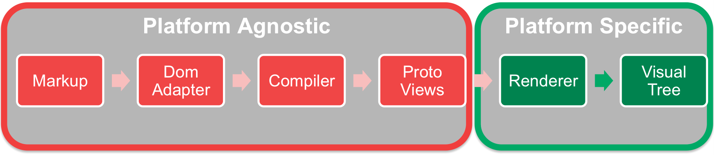
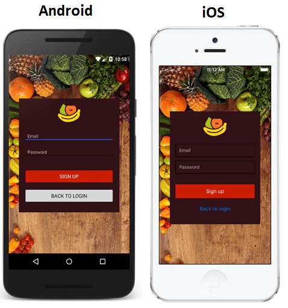
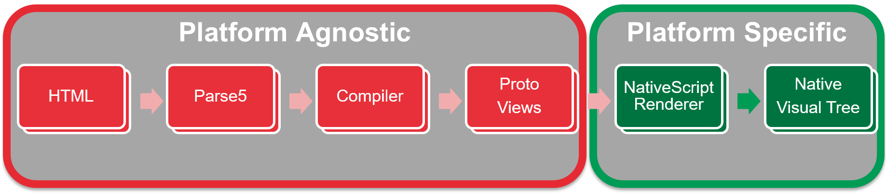

# Building mobile apps with Angular 2 

Angular is the most popular framework for building client side web applications (for more info see [Stack Overflow](http://stackoverflow.com/research/developer-survey-2016#most-popular-technologies-per-occupation)).
Over the last few years it enabled over 1 million developers to build great Single Page Web Applications.
However the framework was always limited to the web only, which meant that you would have to use totally different tools/languages/frameworks if you needed to target desktop and mobile applications as well. 


## Platform agnostic architecture

This is where Angular 2 comes into play. The new version is completely platform agnostic, which means that it is designed to be used with various different platforms (be it web, mobile, desktop or even all kind of [IoT devices](https://medium.com/@urish/building-simon-with-angular2-iot-fceb78bb18e5)).
In simple terms the architecture is split into two parts:
- Platform agnostic - where your markup (HTML) is parsed by a Dom Adapter and then compiled into a set of Proto Views. This process is not specific to any platforms and most of its pieces can be shared between platforms.
- Platform specific - here is where the magic happens. To target each platform you need a Platform Specific Renderer, which based on the Proto Views generates a Visual Tree (used to display the UI). The Renderer is also responsible for propagating the changes and events between the Proto Views and the Visual Tree.



With this architecture in place it was a matter of creating the necessary extensions to target different platforms.  


## Adding mobile to the picture




This opened up the doors to [NativeScript](https://www.nativescript.org/), an Open Source framework for building iOS, Android and ([soon](https://www.nativescript.org/blog/details/nativescript-runtime-preview-for-windows-10)) Windows Universal apps with 100% Native UI.
Since the middle of 2015 both the Angular and the NativeScript teams have been working on bringing the two together. This resulted in the creation of NativeScript 2.0 ([news](http://sdtimes.com/nativescript-2-0-brings-mobile-strategy-options-angularjs-developers/)).

As a result NativeScript uses HTML as the markup to define the UI structure and Parse 5 as the DOM adapter. The biggest work was in implementing the NativeScript Renderer, which provides communication between the Proto Views and the Native UI components.

Here is how this fits in the Angular 2 architecture.



## Why NativeScript


### It works with Angular 2
You can use all of the [Angular 2 syntax](https://angular.io/docs/ts/latest/guide/template-syntax.html#) and get a mobile app as a result:
```HTML
@Component({
  selector: "my-app",
  template: `
  <Page>
    <StackLayout>
      <Button text="Tap Me" (tap)="onTap()"></Button>
      <Label [text]="counter"></Label>
      <Label *ngIf="counter>10" text="WOW!!! you are really good"></Label>
    </StackLayout>
  </Page>
  `
})
export class MyComponent {
  counter: number = 0;
  onTap() {
    this.counter++;
  }
}
```

### Abstraction Layer
NativeScript comes with an extensive abstraction layer, which allows you to build mobile apps with the single code for all supported platforms.
This applies to the UI Abstraction layer, where each [UI Component](http://docs.nativescript.org/ui/ui-views) has an underlying native implementation. For example the below code will give us a ***Native UI*** with a set of Native components.

```HTML
@Component({
  selector: "my-app",
  template: `
  <Page>
    <StackLayout>
      <Button text="GO" (tap)="onTap()" height="50" width="100"></Button>
      <Label [text]="selectedIndex" height="50" width="100"></Label>
      <ListPicker [selectedIndex]="selectedIndex" [items]="items"></ListPicker>
      <DatePicker [day]="day" [month]="month" [year]="year"></DatePicker>
      <TimePicker [hour]="hour" [minute]="minute"></TimePicker>
    </StackLayout>
  </Page>
  `
})
```

Also you get access to a rich set of [core modules](https://github.com/NativeScript/NativeScript/tree/master/tns-core-modules) that abstract out the native functionality. For example if you want to take a picture just use the [camera module](https://docs.nativescript.org/hardware/camera#using-the-camera-module-to-take-a-picture).

Just require the necessary module and call it. The module will take care of the platform specific details.

```JavaScript
import {Image} from "ui/image";
import cameraModule = require("camera");

cameraModule.takePicture().then(picture => {
    console.log("Result is an image source instance");
    var image = new Image();
    image.imageSource = picture;
});
```

And if you are curious what happens on Android ([github](https://github.com/NativeScript/NativeScript/blob/master/tns-core-modules/camera/camera.android.ts#L9-L111)) or iOS ([github](https://github.com/NativeScript/NativeScript/blob/master/tns-core-modules/camera/camera.ios.ts#L82-L126)) when you call takePicture or any of the modules, just check the [github repo](https://github.com/NativeScript/NativeScript/tree/master/tns-core-modules) with all of the core components.

### Direct access to the Native API
Obviously no abstraction layer can cover all the possible functions available on each supported platform. However that doesn't necessarily needs to be a problem, as NativeScript gives you a direct access to the Native API. This means that if you want you could make a direct call to Android or iOS APIs.

For example if you run the below ***JavaScript*** code on Android, you will get a new instance of a file object.

```JavaScript
function openFile() {
  var myFile = new java.io.File("filePath.txt");
  return myFile;
}
```


## Want to learn more?

[](http://www.developer-week.de/)

There will be a couple of talks about NativeScript at DWX, which are really worth attending.
 * Talk: [Introduction to NativeScript][1] on Monday 20-June at 17:00 - in this talk you will learn what NativeScript is made of, how it works inside and you will see some JavaScript examples on how to build mobile apps with it.
 * Talk: [Native Mobile Apps mit NativeScript und Angular 2.0][2] on Wednesday 22-June at 9:00 - in this talk you will learn how we built the NativeScript 2.0, how does it work with Angular 2 and how to aim for a shared code base between mobile and web apps.

There is a great [Getting Started guide](http://docs.nativescript.org/angular/tutorial/ng-chapter-0), which you can follow to build a Native iOS and Android mobile app with Angular2 and NativeScript.


[1]: http://www.developer-week.de/Programm/Veranstaltung/(event)/20557
[2]: http://www.developer-week.de/Programm/Veranstaltung/(event)/20683

---

[](https://twitter.com/sebawita)
[Sebastian Witalec](https://twitter.com/sebawita),  Technical Evangelist for Telerik, a Progress company

[](https://twitter.com/johanneshoppe)
[Johannes Hoppe](https://twitter.com/johanneshoppe), Telerik Developer Expert