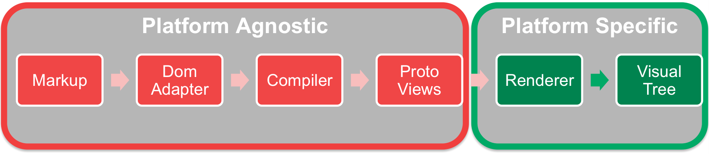
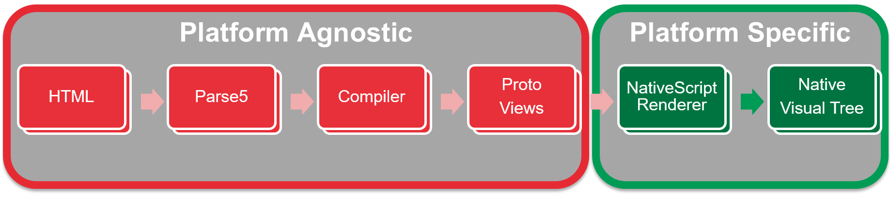

In den letzten Jahre haben mehr als eine Million Entwickler erfolgreich mit AngularJS Single-Page-Anwendungen erstellt. Angular ist damit das populärste Framework um client-seitige Webanwendungen zu entwickeln (siehe z.B.  [Stack Overflow](http://stackoverflow.com/research/developer-survey-2016#most-popular-technologies-per-occupation)). Allerdings blieb das Framework dabei bislang immer auf das Web beschränkt. Das bedeutet, dass man bis dato völlig andere Tools, Programmiersprachen und Frameworks benötigte, um Anwendungen für den Desktop oder für mobile Geräte an den Start zu bringen.


## Plattformunabhängige Architektur

Hier wird Angular interessant. Der komplette Rewrite von AngularJS 1 wurde stark auf Plattformunabhängigkeit ausgerichtet. Das bedeutet, dass das Framework so entworfen wurde, dass diverse Plattformen angesprochen werden können (sei es Web, Mobil, Desktop und sogar [IoT-Geräte](https://medium.com/@urish/building-simon-with-angular2-iot-fceb78bb18e5)).
Vereinfacht ausgedrückt ist die Angular-2-Architektur in zwei Teile aufgeteilt:

- __Plattform-unabhängiger Teil__: hier wir das Markup (HTML) durch einen DOM-Adapter geparst und in so genannte „Proto Views“ compiliert. Dieser Prozess ist nicht spezifisch für eine Zielplattform und die meisten Funktionen können in den verschiedenen Plattformen genutzt werden
- __Plattform-spezifischer Teil__: hier geschieht die Magie. Es werden plattformspezifische Renderer verwendet, um die unterschiedlichen Zielplattformen abzubilden. Jene Renderer haben die Aufgabe, aus den „Proto Views“ einen „Visual Tree“ zu generieren. Dieser kann dann verwendet werden, um die Oberfläche anzuzeigen. Der Renderer ist ebenso dafür verantwortlich, Änderungen und Events zwischen „Proto Views“ und „Visual Tree“ auszutauschen.




Durch diese durchdachte Architektur ist es möglich, neue Ziele zu definieren. Es müssen nur die notwendigen Erweiterungen implementiert werden.


## Native Mobile Anwendungen


Auf Grundlage der plattformunabhängigen Architektur von Angular kann [NativeScript](https://www.nativescript.org/) seine Stärken zeigen. NativeScript ist ein Open-Source-Framework, mit dem man native Apps für iOS, Android und [bald](https://www.nativescript.org/blog/details/nativescript-runtime-preview-for-windows-10) auch Windows 10 bzw. Windows Phone 10 entwickeln kann. „Nativ“ bedeutet, dass tatsächlich echte native UI-Elemente aus der JavaScript-Umgebung heraus angesprochen werden können. Seit Mitte 2015 arbeiten das Angular-Team und das NativeScript-Team zusammen, um beide Frameworks miteinander zu verbinden. Das Ergebnis dieser Zusammenarbeit ist NativeScript 2.0 ([News](http://sdtimes.com/nativescript-2-0-brings-mobile-strategy-options-angularjs-developers/)).

Die Lösung für Angular besteht darin, dass sehr spezielles Markup in HTML definiert wird. Diese Markup kann dann vom DOM-Adapter „Parse5“ geparst werden. Den größten Anteil an der Umsetzung nimmt der „NativeScript Renderer“ ein. Dieser garantiert nicht zuletzt den Austausch zwischen „Proto Views“ und  den nativen UI Komponenten der jeweiligen Platform:




## Warum NativeScript?


### Kurzum: es funktioniert wunderbar mit Angular

Wenn man erstmal die neue [Template-Syntax](https://angular.io/docs/ts/latest/guide/template-syntax.html) von Angular gelernt hat, dann kann man das bestehende Wissen auf eine NativeScript-App übertragen. Hier ist ein einfaches Beispiel, wie ein Button verarbeitet wird. Es fällt auf, dass dies Komponente kein normales HTML beinhaltet:

```HTML
@Component({
  selector: "my-app",
  template: `
  <Page>
    <StackLayout>
      <Button text="Tap Me" (tap)="onTap()"></Button>
      <Label [text]="counter"></Label>
      <Label *ngIf="counter>10" text="WOW!!! you are really good"></Label>
    </StackLayout>
  </Page>
  `
})
export class MyComponent {
  counter: number = 0;
  onTap() {
    this.counter++;
  }
}
```

### Abstraktionsschicht

NativeScript hat eine beträchtliche Abstraktionsschicht an Board, welche die Unterschiede zwischen den unterstützen  Zielplattformen (iOS, Android, UWP) ausbügelt. Hierdurch kann man mit einer einzigen Code-Basis alle nennenswerten Geräte bedienen. Besonders wichtig ist eine gescheite UI-Abstraktion, bei der jede [UI-Komponente](http://docs.nativescript.org/ui/ui-views) eine eigene native Implementierung besitzen muss. Zum Glück müssen wir nicht diese spezifische Implementierungen selbst entwickeln. Es wurde bereits eine grundlegende Auswahl an Bedienelementen vom NativeScript-Team umsetzt. So können wir folgendes Markup definieren und erhalten eine ***native Oberfläche***, die in allen Betriebsystemen die jeweils zu erwarteten Bedienelemente besitzt:

```HTML
@Component({
  selector: "my-app",
  template: `
  <Page>
    <StackLayout>
      <Button text="GO" (tap)="onTap()" height="50" width="100"></Button>
      <Label [text]="selectedIndex" height="50" width="100"></Label>
      <ListPicker [selectedIndex]="selectedIndex" [items]="items"></ListPicker>
      <DatePicker [day]="day" [month]="month" [year]="year"></DatePicker>
      <TimePicker [hour]="hour" [minute]="minute"></TimePicker>
    </StackLayout>
  </Page>
  `
})
```

Weiterhin bietet das NPM-Paket „**T**elerik **N**ative**S**cript Core Modules“ (kurz: [tns-core-modules](https://github.com/NativeScript/NativeScript/tree/master/tns-core-modules)) eine reiche Auswahl an Funktionalitäten, die man gemeinhin für die App-Entwicklung benötigt. Möchte man z.B. ein Foto mit der Kamera machen, so muss man lediglich das entsprechende [Kamera-Modul](https://docs.nativescript.org/hardware/camera#using-the-camera-module-to-take-a-picture) mit `require` laden und es aufrufen. Wie die Kamera in den jeweiligen Betriebssystemen aufgerufen werden muss, braucht uns dann nicht mehr zu interessieren.


```JavaScript
import {Image} from "ui/image";
import cameraModule = require("camera");

cameraModule.takePicture().then(picture => {
    console.log("Result is an image source instance");
    var image = new Image();
    image.imageSource = picture;
});
```

Wenn Sie allerding neugierig sind, was unter Android ([Github](https://github.com/NativeScript/NativeScript/blob/master/tns-core-modules/camera/camera.android.ts#L9-L111)) oder iOS ([Github](https://github.com/NativeScript/NativeScript/blob/master/tns-core-modules/camera/camera.ios.ts#L82-L126)) passiert, wenn die Methode `takePicture` aufgerufen wird, dann schauen sich am einfach das [Github-Repository](https://github.com/NativeScript/NativeScript/tree/master/tns-core-modules) an. Dort sind alle Core-Komponenten gesammelt.


### Direkter Zugriff auf Native APIs

Natürlich kann keine Abstraktionsschicht alle möglichen Funktionen abdecken. Ebenso möchte man womöglich für bestimmte Aufgaben eine native Fremdbibliothek eines Drittanbieters einbinden. Unter NativeScript stellt dies kein Problem dar. Es ist nämlich stets möglich, direkt aus **JavaScript** heraus Android- oder iOS-APIs anzusprechen. Zum Beispiel wird folgender Quelltext unter Android (und nur unter Android) eine Instanz des Datei-Objekts erzeugen:

```JavaScript
function openFile() {
  var myFile = new java.io.File("filePath.txt");
  return myFile;
}
```

Das Beste an der gezeigten Syntax ist die Tatsache, dass sowohl  Namespaces, als auch Attribute und Typen sowie die gesamten Konventionen bei der Benennung dem Pendant aus der Android- bzw. iOS-Dokumentation entspricht. Dasselbe gilt für Fremdbibliotheken. So lässt sich mit geringem Aufwand ein Code-Fragment aus den Dokumentationen oder dem Netz per Copy-and-Paste zum Laufen bringen. Hinter den Kulissen verwendet NativeScript „Reflection“, um eine Liste von APIs aufzubauen, die auf der aktuellen Plattform zur Verfügung stehen und zum globalen Gültigkeitsbereich hinzugefügt werden. Gibt es eine API auf dem Endgerät, dann kann man diese auch aufrufen!


## Lust auf mehr?

[](http://www.developer-week.de/)

Auf der DWX-Developer Week 2016 wird es zwei Vorträge zu NativeScript geben.

* [Introduction to NativeScript][1], 20.06.2016 17:00 - 18:00 Uhr, Track: Cross-Plattform  
  In diesem Talk erfahren Sie, wie NativeScript aufgebaut ist, wie es funktioniert und vor allem wie man performante mobile Apps mit dem Framework entwickeln kann.
* [Native Mobile Apps mit NativeScript und Angular][2], 22.06.2016 09:00 - 10:00 Uhr, Track: Mobile Architekturen
  In diesem schauen wir uns das Zusammenspiel zwischen NativeScript und Angular genauer an. Als besonderes Schmankerl zeigen wir Ihnen, wie man auf Grundlage von Angular Code für mobile Apps und Webanwendungen wiederverwenden kann.


Sie sollten auch den ausführlichen [Getting Started guide](http://docs.nativescript.org/angular/tutorial/ng-chapter-0) durchlesen. Hier erfahren Sie alles Notwendige, um native Apps für iOS und Android auf Basis von Angular2 und NativeScript zu entwickeln.


[1]: http://www.developer-week.de/Programm/Veranstaltung/(event)/20557
[2]: http://www.developer-week.de/Programm/Veranstaltung/(event)/20683

---

[](https://twitter.com/sebawita)
[Sebastian Witalec](https://twitter.com/sebawita),  Technical Evangelist for Telerik, a Progress company

[](https://twitter.com/johanneshoppe)
[Johannes Hoppe](https://twitter.com/johanneshoppe), Telerik Developer Expert
