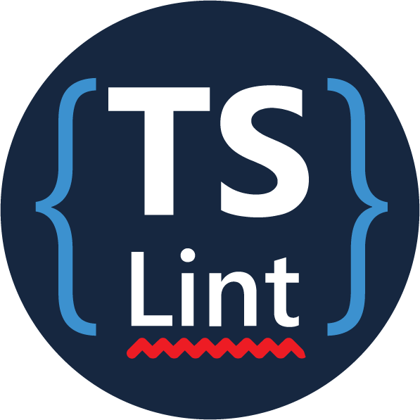

Gut vorbereitet in den Workshop:  
Unsere Visual Studio Code Extension richtet den Editor für Angular ein.

### [&raquo; zum Visual Studio Marktplatz](https://marketplace.visualstudio.com/items?itemName=angular-schule.angular-schule-extension-pack)

---

Die Erweiterung installiert eine Reihe weiterer hilfreicher Erweiterungen:

 
 
 
 
 
 

Weiterhin werden ein paar Einstellungen angepasst:

* Die Icons für die Dateivorschau werden aktiviert (vscode-icons).
* vscode-icons soll automatisch neu starten, wenn ein spezielles Projekt erkannt wurde. Dadurch erhalten wir viele Angular-spezifische Icons.
* Nicht gespeicherte Dateien werden automatisch gespeichert, sobald der Editor den Fokus verliert.
* Der "TypeScript language service" (Fehlermeldungen, automatische Vervollständigung usw. für TypeScript) soll die Definitionen aus dem aktuellen Projektordner verwenden.  

Kurzum: Der Editor ist sofort einsatzbereit.
Wir wünschen viel Spaß mit Angular! 
