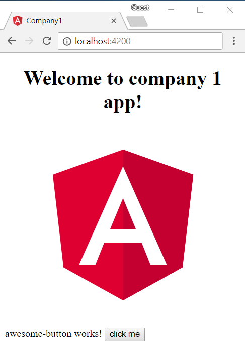

**In this article, I will discuss some ideas how to produce individual Angular apps.
How do we get one app per customer if we have 100+ customers?**

<hr>

Recently, I was asked during a training how to produce customer specific Angular apps.
My first answer was: "That's easy: `NgModules`!". But how exactly? 🤔

## Explanation

I asked a little bit more and got the following explanation from the attendee:

* There is nice a REST API backend with [Swagger](https://swagger.io/) in place. No work here. Hooray!
* There is a (technically outdated) web application to provide the UI.
* Everything should be re-implemented with Angular, of course.
* There are more than, let's say, 100 customers.
* Every customer expects a slightly different application with an individual set of features

One of the current unique selling points are the specific apps.
Every customer can purchase a different set of features for different fields of applications.
This is, for example, the main feature X along with customer management, debt collection and reports.
Bigger customers might also want a full HR solution, and so on. You get the point.

This should be easy to achieve, no matter which technical solution is chosen.
But it gets a bit more challenging, because some forms are very specific for each customer.
For example, the "order acceptance form" might have specific controls based on the customer's individual demands for an order.

Until now the company combined Silverlight and MEF. The technology is outdated,
but it had some great strengths:
It is possible to create a specific app just by adjusting a configuration file and throwing the required libraries (DLL) into the right folder.
If a library is missing, the feature is not shown.
A more specific screen overrides the standard screen (.NET reflection involved as far as I know) – and it works flawlessly. 

## Requirements

The future product/solution should be…

1. fast, and not bloated with unused code because of conditional statements
2. maintainable, a dedicated build for each customer should be avoided if possible


## Ideas

How could we follow this approach? Let's collect some ideas:


### 1. One big monolith

The simplest approach. One single software project must be maintained. 
We could use feature toggles (for example [ngx-feature-toggle](https://github.com/willmendesneto/ngx-feature-toggle)) to enable/disable specific parts of the application:

```html
<feature-toggle [featureName]="'reports'">
  <p>condition is true and reports are shown here.</p>
</feature-toggle>
```

We could also use `*ngIf` directly, but we would need to add some own boilerplate code around.

**PROS:**

* dead simple
* one workspace* to maintain
* one build to maintain

**CONS:**

* spaghetti code to maintain
* unused code everywhere (bigger bundle sizes, possible interference everywhere)
* hard/impossible to deliver different versions to different customers (one update for one customer effects all other customers, too)
* just no

_`*` The term "workspace" refers to one Angular CLI project in one physical folder.
I don't want to confuse this with the word "project" in the context of the new multi application/library support (see below)._


### 2. One fat project, multiple small apps<br>(Extracting everything to NPM packages)

I'm a big fan of Angular modules that are compiled and delivered via NPM.
NPM packages have versions and can demand dependencies.
The great thing: they can be hosted privately
on [NPM](https://docs.npmjs.com/private-modules/intro) or a local mirror like
[myget](https://www.myget.org/),
[TFS](https://docs.microsoft.com/en-us/vsts/package/?view=vsts) (on-premise or in the cloud),
[Nexus](https://www.sonatype.com/nexus-repository-oss),
[verdaccio](https://github.com/verdaccio/verdaccio) (a fork of good-old sinopia) and many more!

Before Angular CLI 6 was released I was used to [`ng-packagr`](https://github.com/dherges/ng-packagr).
It took me some time to configure an existing product to work as described in the demo [`ng-packaged`](https://github.com/dherges/ng-packaged).
But it the end, the work has paid off (e.g. [here](https://github.com/angular-schule/homepage-tools)).
What you get is an NPM package with an Angular library in the [Angular Package Format](https://docs.google.com/document/d/1CZC2rcpxffTDfRDs6p1cfbmKNLA6x5O-NtkJglDaBVs/edit) which is relatively easy to setup but also highly configurable.

With version 6 of the Angular CLI we finally got "official" support for multiple projects in one folder – which is great!
Take a look at the new workspace file (`angular.json`) for that.
A project can either be an application or a library (see [here](https://github.com/angular/angular-cli/wiki/angular-workspace)).
The library support actually works on top of `ng-packagr`.

You can create a library in an existing workspace by running the following command:

```bash
ng generate library my-lib
```

You should now have a library inside `projects/my-lib`.
It contains a component and a service inside an `NgModule`.
Read more about library creation [in the Angular CLI wiki](https://github.com/angular/angular-cli/wiki/stories-create-library).

We could create one (or more) projects that  contain the ultimate, full-blown app.
Every feature would be organized in one `NgNodule` and would be delivered as one NPM package.
Consequently, we would need 100 smaller workspaces that compose those NPM packages.
We would have one big app and each customer has their own Angular CLI solution.

**PROS:**

* easy to setup since there is direct support via Angular CLI now
* every single workspace is highly customizable 
* the dedicated apps only contain the code they need, this should lead to small bundle sizes
* **USP:** we can utilize semver **versioning** to deliver features/patches only to selected applications (and therefore selected customers, too)


**CONS:**

* multiple workspaces to maintain (in the worst case this is 100+1 workspaces)
* multiple builds to maintain
* possible version conflicts in complex scenarios
* historically, Angular CLI and `npm link` were never real friends (see [here](https://github.com/angular/angular-cli/issues/3854#issuecomment-274344771), or [here](https://github.com/angular/angular-cli/issues/6195))


### 3. Monorepo: One fat application with multi application support<br>(No NPM packages involved)

This idea is pretty similar to #2. However, this time we combine multiple apps in one big repo via `angular.json`.
Angular CLI now supports multiple individual applications within one workspace,
each with separate configurations and defaults.
To create another app within an existing workspace you can use the following command:

```bash
ng generate application my-other-app
```

The new application will be generated inside `projects/my-other-app`.
We can now build each application by passing the project name with the build command:

```bash
ng build my-other-app
```

Approach #2 was based on the idea of multiple libraries.
Now we have multiple apps which derive from the big fat application.
We reduce complexity, since we don't need to publish a big amount of NPM packages around.
The first application could be the "big fat application" that contains all feature modules and shared modules to have the full picture.
All other applications could only use the required NgModules – and not more.

**PROS:**

* easy to setup, since there is direct support via Angular CLI
* small bundle sizes, too
* one workspace to maintain
* one build to maintain (if we build multiple apps in one big build)
* no versioning (this can be a good point, everything is in sync with everything else)


**CONS:**

* the build will have a very long runtime if we choose to build all apps
* no versioning: we can not utilize semver versioning to deliver features/patches only to selected applications


## Hands on!

I see pretty few disadvantages for the last approach, so I definitely recommend #3.
If this doesn't scale, we can still mix #2 and #3 by extracting some parts into separate NPM packages.


#### DIY Monorepo

Let's try this out using the Angular CLI (v6.0.3 at the time of writing).


```bash
npm install -g @angular/cli
ng new one-app-per-customer --routing
cd one-app-per-customer
ng generate application company1 --routing --prefix=company1
ng generate application company2 --routing --prefix=company2
ng generate library shared-lib --prefix=shared-lib
```

Feel free to tweak the folder structure a bit by adjusting `angular.json`.
For example, Nrwl Nx (see below) creates a folder called `/apps` and another one called `/libs` in the root of the workspace.
This is for sure cleaner than the default folder structure of the Angular CLI.
But lets keep it as it is, for now.
We can now run each application with:

```bash
ng serve -o
ng serve company1 -o
ng serve company2 -o
```

That was easy!
Let's add a new component to the library:

```bash
cd projects/shared-lib/src/lib
ng g component awesome-button --flat --export
```

This will create the new component at the right place and also tweaks the libraries module so that the component can be imported from other places. 

It's a good idea to adjust the public API surface of shared-lib and add the following line to `public_api.ts`:

```ts
export * from './lib/awesome-button.component';
```

In our case this step is not strictly required, we can use the component within our templates anyway.
However, it will be useful to have access to that type, e.g. if you want to use the [NgComponentOutlet](https://angular.io/api/common/NgComponentOutlet) later on.

__It's important to note that your app can never use your library before it is built.__
So we have to call the following command every time we did a change in the lib:

```bash
ng build shared-lib
```

Running `ng build` every time you change a file is bothersome and takes time.
In the future the Angular CLI team wants to add watch support to building libraries so it is faster to see changes.
Please refer to [this documentation](https://github.com/angular/angular-cli/blob/267532d1f26b9a52b80f46e3f16b4afe6497fc00/docs/documentation/stories/create-library.md) for a full explanation of the current limitation.
However, I don't think that we have to wait a long time for a suitable solution.


Take a look at the topmost `tsconfig.json` and its `paths` property:

```ts
{
  [...]

    "paths": {
      "shared-lib": [
        "dist/shared-lib"
      ]
    }

  [...]
}
```

This allows us to import the `AwesomeButtonComponent` via its module like this:

```ts
// one-app-per-customer/projects/company1/src/app/app.module.ts

import { SharedLibModule } from 'shared-lib';
// [...]

@NgModule({
  declarations: [
    AppComponent
  ],
  imports: [
    BrowserModule,
    SharedLibModule
  ],
  bootstrap: [AppComponent]
})
export class AppModule { }
```



Awesome! :wink:


#### Nrwl Nx


Another way to start is [Nrwl Nx](https://github.com/nrwl/nx-examples):

```bash
npm install -g @angular/cli @nrwl/schematics 
create-nx-workspace one-app-per-customer
cd one-app-per-customer
ng generate app big-fat-app --routing
ng generate app company1 --routing
ng generate app company2 --routing
ng generate library shared-lib
``` 

All commands are explained [here](https://github.com/nrwl/nx-examples).
This gives you the quickest possible out-of-the-box solution available.
The folder structure is beautiful by default and we have a ton of blueprints (schematics) available.
It looks almost the same, but the `ng generate` commands will produce different output, since under the hood another schematic is used.
For example, the `--prefix` option will be ignored as the tool follows another convention. Also the router configuration will be inline and so on.
You may like this different flavor.

However, we have to keep in mind that `@nrwl/schematics` adds yet another dependency and a layer of abstraction into the solution.
Personally, I'd stick to the DYI approach. 
We can achieve almost the same with pure Angular CLI – and still get inspiration by using the best ideas from Nx.


## Conclusion

In this article we discussed different approaches towards structuring a workspace to handle multiple applications that share code.
I personally like the "monorepo" approach.
We also created a first prototype via the Angular CLI, which was easy to setup – thanks to the new support for multiple applications.
You can find the full example here:

* __https://github.com/angular-schule/one-app-per-customer__

   


## Thanks

Many thanks to __[Manfred Steyer](http://www.softwarearchitekt.at/)__ and __[Juri Strumpflohner](https://juristr.com/)__ for taking a look at this article before publishing.
I really appreciate your feedback! :+1:

And a big thank-you goes to __Ferdinand__ for reviewing all my texts! :wink:


<hr>

<small>Header image based on picture by [FreeImages.com/Zsuzsa N.K.](https://www.freeimages.com/photo/buttons-1414105)</small>

