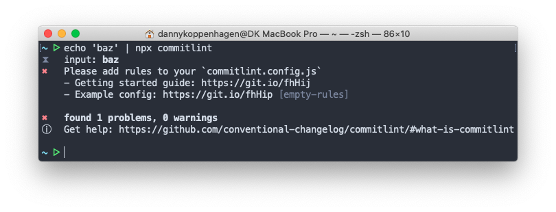

**In this article I would like to introduce ngx-semantic-version.
This new Angular Schematic allows you to use consistent git commit messages and publish new versions.
It will help you to keep your CHANGELOG.md file up to date and release new tagged versions.**

<hr>

Table of contents:

- [Introduction](/blog/2019-10-ngx-semantic-version#introduction)
- [What does it do?](/blog/2019-10-ngx-semantic-version#what-does-it-do-)
  - [commitlint](/blog/2019-10-ngx-semantic-version#commitlint)
  - [husky](/blog/2019-10-ngx-semantic-version#husky)
  - [commitizen](/blog/2019-10-ngx-semantic-version#commitizen)
  - [standard-version](/blog/2019-10-ngx-semantic-version#standard-version)
- [How to use](/blog/2019-10-ngx-semantic-version#how-to-use)
- [Conclusion](/blog/2019-10-ngx-semantic-version#conclusion)

## Introduction

Surviving in the stressful day-to-day life of a developer is not that easy. One feature follows the other, lots of bugs and breaking changes. With all the hustle and bustle, there's actually no time to write proper commit messages.

At the end of all days our git history looks like this:

```text
* 65f597a (HEAD -> master) adjust readme
* f874d16 forgot to bump up version
* 3fa9f1e release
* d09e4ee now it's fixed!
* 70c7a9b this should really fix the build
* 5f91dab let the build work (hopefully)
* 44c45b7 adds some file
* 7ac82d3 lot's of stuff
* 1e34db6 initial commit
```

When checking this history you know almost nothing: neither what features has been integrated nor if there was a bugfix or at least some other meaningful context.

Wouldn’t it be nice to have a cleaner git messages that will follow a de facto standard which is commonly used?

But more than this: having a clean and good formatted git history can help us releasing new software versions respecting semantic versioning and generating a changelog that includes all the changes we made and references to the commits.

No more struggle with with forgetting increasing the version in your `package.json`. No more manual changes in the `CHANGELOG.md` and forgetting to reference a git commit. Wouldn‘t it be nice to automate the release process and generate the changelog and the package version by just checking and building it from a clean git history?
And wouldn’t it be nice to add all this stuff with one very simple command to your Angular project?

__Using [_ngx-semantic-version_](https://www.npmjs.com/package/ngx-semantic-version) will give you all that.__

## What does it do?

_ngx-semantic-version_ will add and configure the following packages for you.
We will have a look on each tool in this article.

- [commitlint](https://commitlint.js.org)
- [husky](https://www.npmjs.com/package/husky)
- [commitizen](https://www.npmjs.com/package/commitizen)
- [standard-version](https://www.npmjs.com/package/standard-version)

### commitlint

Commitlint will give you the ability to check your commit messages for a common pattern: the [_conventional-commit_](https://www.conventionalcommits.org) pattern requires us follow this simple syntax:

```
<type>[optional scope]: <description>

[optional body]

[optional footer]
```

- `type` can be one of the following codes:
  - `build`
  - `ci`
  - `chore`
  - `docs`
  - `feat`
  - `fix`
  - `perf`
  - `refactor`
  - `revert`
  - `style`
  - `test`
- `scope` is optional and can be used to reference to a specific part of your application, e.g. `fix(dashboard): fallback for older browsers`
- The `description` is mandatory  and it describes the commit in a very short form
- If necessary, a `body` and a `footer` with further information can be added which may contain:
  - The keyword `BREAKING CHANGES` followed by a description of the breaking changes
  - A reference to an Github issue (or an other referencs, e.g. JIRA ticket number, etc.)

Following this pattern allows us later to extract valuable information from the git history.
We can generate a well-formatted changelog file without any manual effort.
It can be determined what version part will be increased and many more.

To find out if a commit message meets the requirements, we can use the `commitlint` command:



### husky

Husky allows us to hook into the git lifecycle using nodejs. It is used by _ngx-semantic-version_ to check a commit message right before storing it by using _commitlint_.

### commitizen

Defining the good message text can be be quite hard when you are not used to the _conventional-changelog_ style.
The tool commitizen is there to help beginners and to prevent your own negligence.
It introduced a lots of restrictions  for our commit messages.
Commitizen will help you to build a commit message always in the appropriate format by letting you configure the final message via an interactive cli.


If you are using Visual Studio Code, you can also use the plugin [Visual Studio Code Commitizen Support](https://marketplace.visualstudio.com/items?itemName=KnisterPeter.vscode-commitizen) which will let you build the commit message directly in the editor:


### standard-version

Standard-version is the cherry on the cake and takes advantage from a well formed git history.
It will extract the commit message information like `fix`, `feature` and `BREAKING CHANGES` and use this information for creating a well formatted `CHANGELOG.md` file.
I will also determine the a version for our project.
Of course, numbers will be increased according to the [rules of semantic versioning](https://semver.org/).

Whenever you will release a version, you can use _standard-version_ and it will keep your versioning clean and your `CHANGELOG.md` up-to-date.
Furthermore, it will link all commits in your `CHANGELOG.md` and references to the closes issues from your trouble ticket system, so that it's easy to understand what has been done in the release.

## How to use

Are you excited, too? Then let's get started!

Now we know what all the tools are doing but we haven't implemented them yet. Here _ngx-semantic-version_ enters the game. It is an Angular schematic that will add and configure all the tools for you.

You simply need to run the following command:

```bash
ng add ngx-semantic-version
```

After installation, you `package.json` file is updaded.
You will also find a file named `commitlint.config.js` which includes the basic ruleset for conventional commit.
You can [adjust the configuration](https://commitlint.js.org/#/reference-rules) to satisfy your needs even more.

Try it out to make some changes to your project! Commitlint will now check the commit message and tell you if it is valid or not. It prevents you from adding bad commit messages to your project.
_Commitizen_ will support you by building the message in the right format and it even explicitly asks you for issue references and Breaking Changes – it's really helpful.

If you typically use `npm version` to cut a new release, do this instead:

```bash
npm run release
```

You should also consider use one of the following commands:

```
npm run release -- --first-release    # create the initial release and create the `CHANGELOG.md`
npm run release -- --prerelease       # create a pre-release instead of a regular one
```

_standard-version_ will now do the following:

1. It "bumps" the version in `package.json`.
2. It updates the `CHANGELOG.md` file
3. It commits the `package.json` and `CHANGELOG.md` files
4. It tags a new release in the git history.

Check out the [official documentation](https://www.npmjs.com/package/standard-version#release-as-a-pre-release) for further information.

## Conclusion

I hope that `ngx-semantic-version` will make your daily work easier. If you have a problem, please feel free to open an [issue](https://github.com/d-koppenhagen/ngx-semantic-version/issues). And if you have any improvements, I'm especially happy about a [pull-request](https://github.com/d-koppenhagen/ngx-semantic-version/pulls).

**Happy coding, committing and releasing!**

<hr>

## Thank you

Special thanks go to

- [Ferdinand Malcher](https://twitter.com/fmalcher01) for revising this article and discussing things.
- [Johannes Hoppe](https://twitter.com/fmalcher01) for revising this article and discussing things.
