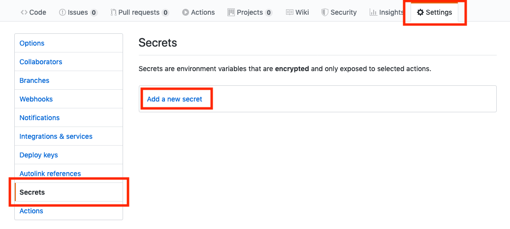
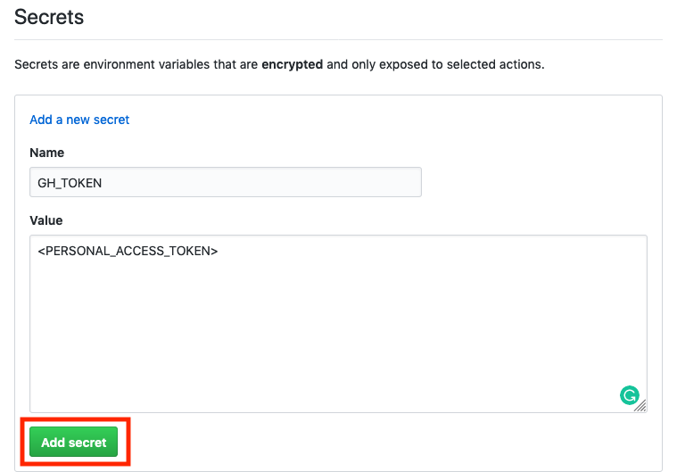
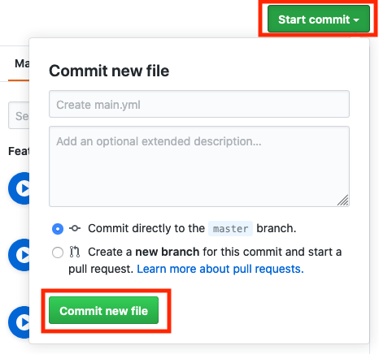

**We all know that `angular-cli-ghpages` made it real smooth to deploy our Angular app on `Github Pages`. With that, `Github Actions` beta is already out and will be generally available soon. In this article, we will see, how to utilize `angular-cli-ghpages` with Github Actions.**

- [Introduction](/blog/2019-11-angular-cli-ghpages-github-actions#introduction)
- [Prerequisites](/blog/2019-11-angular-cli-ghpages-github-actions#prerequisites)
- [Getting started](/blog/2019-11-angular-cli-ghpages-github-actions#getting-started)
  - [Setup Tokens](/blog/2019-11-angular-cli-ghpages-github-actions#setup-tokens)
  - [Setup Github Action Flow](/blog/2019-11-angular-cli-ghpages-github-actions#setup-github-action-flow)
- [Summary](/blog/2019-11-angular-cli-ghpages-github-actions#summary)

## Introduction

### angular-cli-ghpages

    Deploy your Angular app to GitHub pages directly from the Angular CLI! 🚀

All it takes is just two commands in terminal to deploy your Angular app on Github Pages:

    ```bash
    ng add angular-cli-ghpages
    ng deploy
    ```

Checkout there [repo](https://github.com/angular-schule/angular-cli-ghpages#angular-cli-ghpages) for more information.

### Github Actions

    GitHub Actions makes it easy to automate all your software workflows, now with world-class CI/CD. Build, test, and deploy your code right from GitHub. Make code reviews, branch management, and issue triaging work the way you want.

You will need to create Actions YAML file and Github will take care of the rest.

Take a look at it's [official documentation](https://help.github.com/en/actions/automating-your-workflow-with-github-actions) for more.

## Prerequisites

1. You've signed up for GitHub Actions. [Learn more](https://github.com/features/actions).
2. Take a look at the documentation for:
   1. [GitHub Actions](https://github.com/features/actions)
   2. [Github Pages](https://pages.github.com/)
3. Not required, but it would be great if you've written some form of YML code before and have minimal knowledge of the syntax.
4. You have a working Angular app. If not, you can [quickly set it up](https://angular.io/guide/setup-local).
5. Your Angular app is pushed on Github.
6. You have added **angular-cli-ghpages** in your project. If not:
   - Please checkout [Quick Start Guide](https://github.com/angular-schule/angular-cli-ghpages#-quick-start-local-development-) 
   - Or simply run `ng add angular-cli-ghpages` in your project.

## Getting started

Please ensure that you've read the [prerequisites](/blog/2019-11-angular-cli-ghpages-github-actions#prerequisites) section before continuing with this section. We are assuming that you have a Angular app, which is pushed on Github and has `angular-cli-ghpages` added.

### Setup Tokens

1. Create a [Personal Access Token with repo access](https://help.github.com/en/articles/creating-a-personal-access-token-for-the-command-line) (POA) and copy the token and store it some where safe.
   - Make sure it has this access:
  
        
2. Open up your Angular app's Github repo.
3. Go to **Settings** > **Secrets** and click on **Add a new secret**.

    
4. Create a secret with name `GH_TOKEN` and paste your POA (which you copied / stored in step 1) in value. Make sure to click on green **Add secret** button to save it.

    

### Setup Github Action Flow

1. Now, in your repo, go to **Actions** and click on **Set up workflow yourself**.

    

2. A New File editor will open, keep the file name (e.g. *main.yml*) as it is, simply replace all content to below:

    ```yml
    name: Node CI

    on: [push]

    jobs:
    build:
        runs-on: ubuntu-latest

        steps:
        - uses: actions/checkout@v1
        - name: Use Node.js 10.x
            uses: actions/setup-node@v1
            with:
            node-version: 10.x
        - name: npm install, lint, test, build and deploy
            run: |
            npm install
            npm run lint
            ###
            # You can un-comment below 2 test scripts, if you have made respective changes mentioned at https://angular.io/guide/testing#configure-cli-for-ci-testing-in-chrome
            ###
            # npm test -- --no-watch --no-progress --browsers=ChromeHeadlessCI
            # npm run e2e -- --protractor-config=e2e/protractor-ci.conf.js
            npm run deploy -- --name="<YOUR_GITHUB_USERNAME>" --email=<YOUR_GITHUB_USER_EMAIL_ADDRESS>
            env:
            CI: true
            GH_TOKEN: ${{ secrets.GH_TOKEN }}
    ```

3. Now, if you want Github Actions CI/CD to perform tests, you will need to [make some configurations](https://angular.io/guide/testing#configure-cli-for-ci-testing-in-chrome) in your Angular app. And then you can un-comment the `npm test ...` and `npm run e2e ...` commands in above Actions YAML file.
4. Make sure to replace **<YOUR_GITHUB_USERNAME>** and **<YOUR_GITHUB_USER_EMAIL_ADDRESS>** with correct values in above snippet.
5. You can also control when your workflows are triggered:
   - It can be helpful to not have your workflows run on every push to every branch in the repo.
     - For example, you can have your workflow run on push events to master and release branches:

        ```yml
        on:
        push:
            branches:
            - master
            - release/*
        ```

     - or only run on pull_request events that target the master branch:

        ```yml
        on:
          pull_request:
            branches:
            - master
        ```

     - or, run every day of the week from Monday - Friday at 02:00:

        ```yml
        on:
          schedule:
          - cron: 0 2 * * 1-5
        ```

   - For more information see [Events that trigger workflows](https://help.github.com/articles/events-that-trigger-workflows) and [Workflow syntax for GitHub Actions](https://help.github.com/articles/workflow-syntax-for-github-actions#on).

6. Then, click on **Start commit**, add message and description if you like and click on **Commit new file**.

    
7. Done ✅.

Now next time when you push your changes to Github, Github Actions will run the workflow we created and it will deploy your updated app on Github Pages.

## Summary

I hope that now you know how to setup `angular-cli-ghpages` with Github Actions. Please checkout [angular-cli-ghpages options](https://github.com/angular-schule/angular-cli-ghpages/#options) for more options to deploy, like: `--repo <URL>` to deploy your app to different repo's Github Pages. And it's not just CI/CD setup, there are lot many things we can do in [Github Actions](https://github.com/features/actions). Also checkout [Github Marketplace for Actions](https://github.com/marketplace?type=actions) to see more workflows.

## Thank you

Special thanks go to [Johannes Hoppe](https://twitter.com/fmalcher01) for giving me an opprtunity to write this article.

<small>**Header image:** Photo by [SpaceX](https://unsplash.com/@spacex?utm_source=unsplash&utm_medium=referral&utm_content=creditCopyText) on [Unsplash](https://unsplash.com/s/photos/launch?utm_source=unsplash&utm_medium=referral&utm_content=creditCopyText)</small>

....
