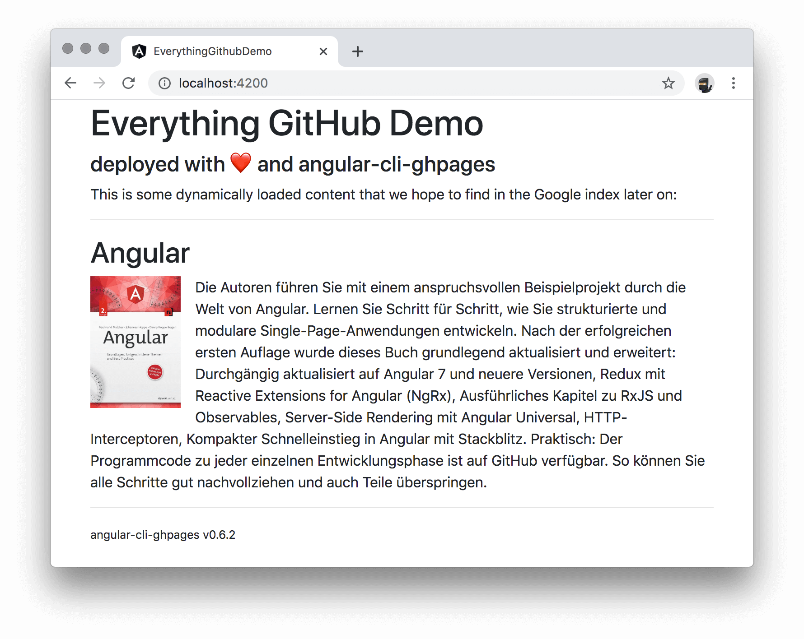
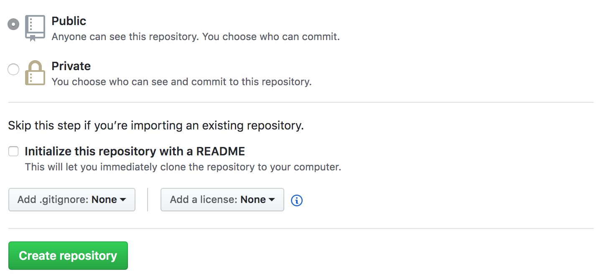
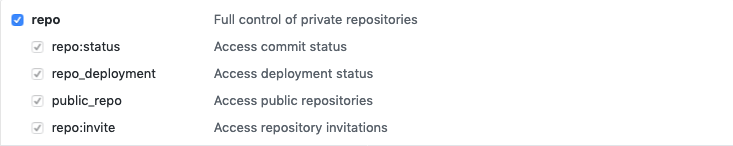
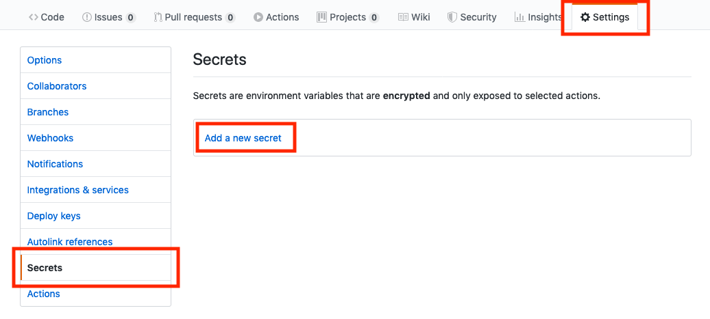
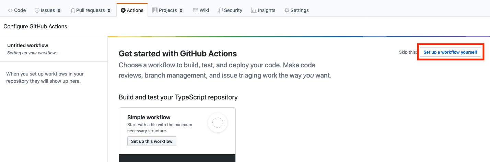
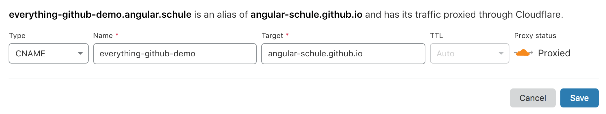
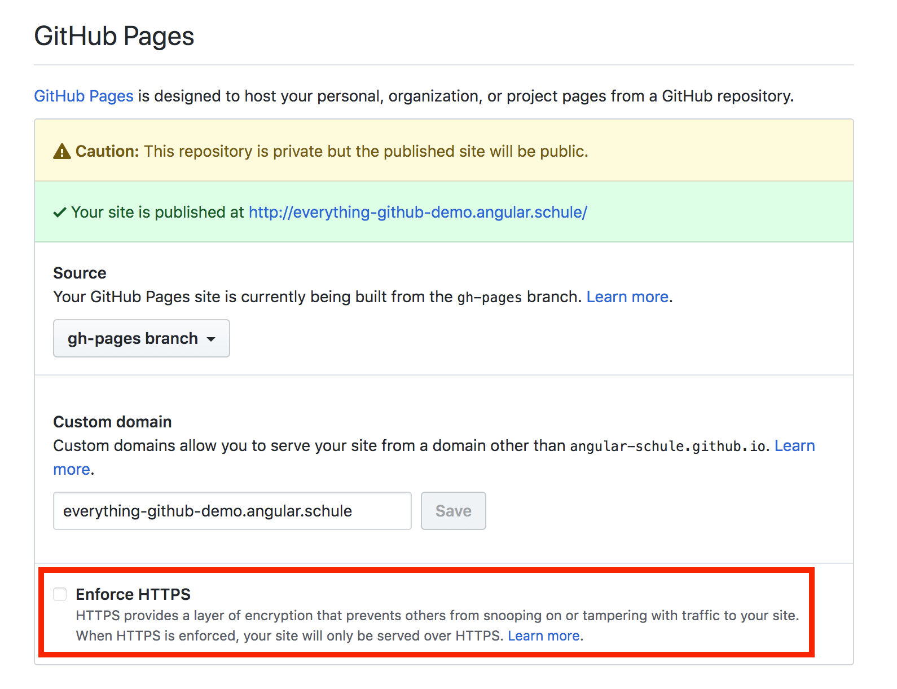
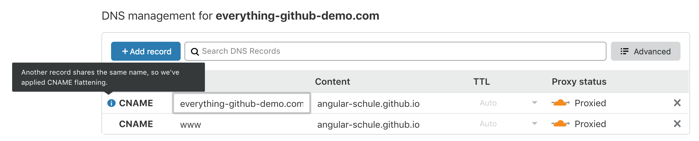

**In this article we want to use several tools from the GitHub universe to launch a website with Angular.
We will establish a professional pipeline, including version management, continuous deployment and web hosting.
Best of all, for public repositories, this won't cost you a single cent!**

<hr>

Table of contents:

- [Introduction](/blog/2020-01-everything-github#introduction)
- [1. All parts explained](/blog/2020-01-everything-github#1-all-parts-explained)
  - [1.1. Git and GitHub Version Control](/blog/2020-01-everything-github#11-git-and-github-version-control)
  - [1.2. GitHub Actions](/blog/2020-01-everything-github#12-github-actions)
  - [1.3. GitHub Pages](/blog/2020-01-everything-github#13-github-pages)
  - [1.4. angular-cli-ghpages](/blog/2020-01-everything-github#14-angular-cli-ghpages)
  - [1.5. GitHub plans](/blog/2020-01-everything-github#15-github-plans)
- [2. A simple Angular app](/blog/2020-01-everything-github#2-a-simple-angular-app)
- [3. Hosting the source code on GitHub](/blog/2020-01-everything-github#3-hosting-the-source-code-on-github)
- [4. A first deployment to GitHub Pages](/blog/2020-01-everything-github#4-a-first-deployment-to-github-pages)
- [5. Automating the Deployment with GitHub Actions](/blog/2020-01-everything-github#5-automating-the-deployment-with-github-actions)
  - [5.1 About all tokens](/blog/2020-01-everything-github#51-about-all-tokens)
  - [5.2 Automate a public repo (via GH_TOKEN)](/blog/2020-01-everything-github#52-automate-a-public-repo-via-ghtoken)
    - [5.2.1 Setup a Personal Access Token](/blog/2020-01-everything-github#521-setup-a-personal-access-token)
    - [5.2.2 Setup the GitHub Action Workflow](/blog/2020-01-everything-github#522-setup-the-github-action-workflow)
  - [5.3 Automate a private repo (via GITHUB_TOKEN)](/blog/2020-01-everything-github#53-automate-a-private-repo-via-githubtoken)
- [6. Extra: Custom Domains](/blog/2020-01-everything-github#6-extra-custom-domains)
  - [6.1 Configuring a subdomain](/blog/2020-01-everything-github#61-configuring-a-subdomain)
  - [6.2 Configuring an apex domain](/blog/2020-01-everything-github#62-configuring-an-apex-domain)
- [Summary](/blog/2020-01-everything-github#summary)

## Introduction

All starts are hard, so we will try to explain all steps in detail, so that you can eventually come up with a fully deployed Angular app.
During our journey we will get comfortable with `angular-cli-ghpages` and GitHub Actions, and see how they work together.
We will create and setup tokens and GitHub Action YAML files, to deploy our Angular app directly to GitHub Pages, a free webhosting service from GitHub.


## 1. All parts explained

### 1.1. Git and GitHub Version Control

Version Control allows you to keep track of your work and helps you to easily recognize the changes you have made, whether it is program code, text, images or other data.
This is also absolutely necessary if you want to work together in a team efficiently.
[Git](https://git-scm.com/) is a free software for distributed version management and is currently the most popular solution.
The leading platform around Git is GitHub, which belongs to Microsoft since the end of 2018.

### 1.2. GitHub Actions

[GitHub Actions](https://github.com/features/actions) is a solution for CI/CD pipelines (continuous integration and continuous delivery).
With actions we can test, build and release our code and while staying in the GitHub ecosystem.
GitHub has just recently launched this product to the market and is now directly competing with Travis CI, CircleCI or AppVeyor.
In contrast to former CI/CD monsters it is common with all mentioned providers to express the individual steps in the form of a YAML file and to store this file as part of the source code in the repository.
    
### 1.3. GitHub Pages

You can use [GitHub Pages](https://pages.github.com/) to host a website directly from a GitHub repository.
This website can either contain completely static content (i.e. pure HTML files and assets, but no scripts running on the server) or you can use Jekyll to convert Markdown files to static content.
Since we work with Angular, we do not need Jekyll as a static site generator .
A good companion for Angular is the static site generator [Scully](https://github.com/scullyio/scully), which we will definitely cover in an upcoming article. 

### 1.4. angular-cli-ghpages

[angular-cli-ghpages](https://github.com/angular-schule/angular-cli-ghpages) is a project made by Johannes Hoppe, one of the two authors of this article.
His Angular Book uses a new GitHub repository in every chapter (so there are quite a lot of repos 😅).
So he developed a solution that makes it as easy as possible to bring an Angular App to GitHub Pages.
The project exists since 2016 and if it was started today, it would certainly have a nicer name.
According to GitHub, 7100 projects already deploy their apps with angular-cli-ghpages.

### 1.5. GitHub plans

The following information is based on the details from [the pricing page](https://github.com/pricing). 

The **free plan** gives you:
* unlimited public repositories
* unlimited private repositories
* only 3 collaborators for private repositories
* 2000 total GitHub action minutes/month

The **pro plan** gives you:

* everything that is included in the free plan
* unlimited collaborators
* 3000 total action minutes/month 

Back in 2016, GitHub migrated from a pricing based on the number of repositories to a new schema that considers the number of users. **Legacy plans** do not have access to GitHub Actions.

This article will distinguish several times between private and public repos.
The reason behind this is due to the following point, which we must take into account:

**GitHub Pages** is available... 
* in public repositories with GitHub Free.
* in public and **private** repositories with GitHub Pro and all the other paid plans.

| Plan              | Private repos | Actions | Pages for public repos | Pages for private repos | 
|-------------------|:-------------:|:-------:|:----------------------:|:-----------------------:| 
| Free              | ✅️            | ✅️      | ✅️                    | ❌️                      |
| Pro and Higher    | ✅️            | ✅️      | ✅️                    | ✅️                      |
| Legacy paid plans | ✅️            | ❌️      | ✅️                    | ?                       |


Please register an account on github.com, if you haven't already done so.  
**For this article, it is sufficient to use the free plan!**

## 2. A simple Angular app

We assume that the majority of our readers have already worked with Angular. However, in order for this article to be as complete as possible, we will very shortly set up a simple website based on Angular.

1. If you have not already done so, please install [Node.js](https://nodejs.org), [Google Chrome](https://www.google.com/chrome/) and optionally [Visual Studio Code](https://code.visualstudio.com). Later on we also need [Git](https://git-scm.com/) for the deployment.

2. Install the latest version of the Angular CLI  globally and create a new Angular project.

    ```sh
    npm install -g @angular/cli
    ng new everything-github-demo --defaults
    ```

3. Now we want to make some small changes to the source code.
    With the command `code .` we open the current directory in the *Visual Studio Code* editor. Of course you can also open the folder through the menus of VS Code.

    ```sh
    cd everything-github-demo
    code .
    ```

4. We change the content of the `AppModule` and `AppComponent` a bit and call a HTTP API. By this, we want to prove that the Google search engine can correctly crawl our website – even with data loaded from remote.

    ```ts
    // src/app/app.module.ts (excerpt)
  
    import { HttpClientModule } from '@angular/common/http';
  
    @NgModule({
      declarations: [
        AppComponent
      ],
      imports: [
        BrowserModule,
        HttpClientModule // NEW: import HttpClientModule!
      ],
      bootstrap: [AppComponent]
    })
    export class AppModule { }
    
    ```
  
    For example, we could load a book from our backend at https://api.angular.schule.
  
    ```ts
    // src/app/app.component.ts
  
    import { Component } from '@angular/core';
    import { HttpClient } from '@angular/common/http';
  
    @Component({
      selector: 'app-root',
      templateUrl: './app.component.html',
      styleUrls: ['./app.component.css']
    })
    export class AppComponent {
      book: any = { };
  
      constructor(http: HttpClient) {
        http.get('https://api.angular.schule/book/9783864906466')
          .subscribe(b => this.book = b);
      }
    }
    
    ```
  
    ```html
    <!-- src/app/app.component.html -->
  
    <h1>Everything GitHub Demo</h1>
    <h4>deployed with ❤️ and angular-cli-ghpages</h4>
  
    <p>
      This is some dynamically loaded content that we hope to find in the Google index later on:
    </p>
  
    <hr>
  
    <h2>{{ book.title }}</h2>
    <p>
      
      {{ book.description }}
    </p>
    ```

    This example loads data from a remote API. Our hope is that later we will be able to find both the regular text as well as the loaded book in the index of our preferred search engine. We have also added [Bootstrap CSS](https://getbootstrap.com) to make the result look like this:

    


## 3. Hosting the source code on GitHub

Now we take care of version management.
This is very easy because the Angular CLI has already created a local Git repository for us. 

1. First things first: Let's save the latest changes.
   
  ```sh
  git add .
  git commit -m "chore: demo content"
  ```

2. Let's crete a GitHub repository. In the upper-right corner of any GitHub page, use the ➕ drop-down menu, and select **New repository**.

    

3. Choose a short, memorable name for your repository.
    In our example, we will call it `everything-github-demo`.

4. For now, choose to make the repository **public**.
    Please note, the source code of public repositories is visible to the public.
    Since we want to use the free GitHub plan, we have to keep it public or we would lose access to the free hosting service of GitHub Pages.
  
    <!-- > There's one naughty little trick to work around that limitation, but we'll talk about that later on. -->

5. Since we already have source code, you should **not** initialize the repository with a README.

    

6. After you have pressed "Create Repository" a confirmation page will appear.
    You can now connect to GitHub using SSH or HTTPS.
    Both ways will work, but [GitHub recommends HTTPS](https://help.github.com/en/github/using-git/which-remote-url-should-i-use).
    If you are completely lost in authenticating against GitHub, try cloning another repository with [GitHub Desktop](https://desktop.github.com/) first.
    For the remaining article we assume that the communication has been successfully established.

    To add GitHub as a new remote for our local repository, use the `git remote add` command:

    ```sh
    git remote add origin https://github.com/<username>/<repositoryname>.git
    ```
  
    Replace `<username>` (or organisation name) and `<repositoryname>` with your username from GitHub and the name of your new repository.
    <small>(In our example, it's `git remote add origin https://github.com/angular-schule/everything-github-demo.git`)</small>

7. Finally, we can transfer the whole repository to GitHub:

  ```sh
  git push -u origin master
  ```
   
## 4. A first deployment to GitHub Pages

We are now ready to host our first app on GitHub Pages.
For this, the project must be compiled first and the compiled assets should be pushed to a new branch.
That functionality is provided by `angular-cli-ghpages`.
GitHub will activate the hosting automatically, if this branch has the name `gh-pages` – which is the default setting for `angular-cli-ghpages`.

1. The following command adds `angular-cli-ghpages` to your project.

    ```sh
    ng add angular-cli-ghpages
    ```

2. Now we can deploy our project to GitHub pages with all default settings.
    The project will be automatically built in production mode:

    ```sh
   ng deploy
    ```

    The deployment will create a temporary git repository and will commit/push all files 
    from `dist/everything-github-demo` to a branch with the name `gh-pages`.
    
    However, in this example we haven't provided a target repository.
    In this case the deployment assumes that the current working directory is already a Git repository,
    and that we want to push changes to the same repository with the name `origin`.
    We have prepared this before with the command `git remote add`, so there is nothing to do here for us.  

3. The app should be available at `https://<username>.github.io/<repositoryname>/` soon.
   If it is not immediately available, you should first wait a moment.

4. If we now check the results (in our case at [https://angular-schule.github.io/everything-github-demo/](https://angular-schule.github.io/everything-github-demo/)) we will see a blank page! 😲
    But no problem, we open the Console panel of the Chrome DevTools by pressing `Control+Shift+I` (Windows, Linux) or `Command+Option+I` (Mac).
    We immediately see some red 404 errors for all files:

    > Failed to load resource: the server responded with a status of 404 ()

    The reason for this:
    The application is configured as if it is running in the root path of the domain.
    However, this is not the case here!
    Our application is located in the `/<repositoryname>/` path, so all links are broken.
    Of course, this is adjustable – let's try the deployment a second time with the `--base-href` option:

    ```sh
    ng deploy --base-href=/<repositoryname>/

    # so in our case it must be
    ng deploy --base-href=/everything-github-demo/
    ```

    **Hint:** Please make sure to really add the trailing slash. It won't work without!

5. Now you should see our app running on GitHub Pages!
    You can make sure that everything went well by going into the **Settings** of the repo.
    Scroll down there to the *GitHub Pages* section.
    The following should appear here:

    

    **Hint:** You can also see the setting for a custom domain here.
    Please do not try to set a value.
    This will work at first, but the setting is not permanent, because `angular-cli-ghpages` will overwrite it again.

6. Now add, commit and push the changes:
    ```sh
    git add .
    git commit -m "build: add angular-cli-gh-pages"
    git push origin master
    ```

## 5. Automating the Deployment with GitHub Actions

We don't want to stop here and trigger the deployment manually all the time.
An ideally workflow would be to make changes to the app and the deployment will then be handled automatically for us.
For this we want to use GitHub Actions which is now available for all repositories.
So there is no need to register anymore, we can start right now! 🚀

As with all CI/CD systems, we have to think about how to grant the necessary write permissions to our repo.

### 5.1 About all tokens


The easiest way to grant access to the repository is to implement this with tokens.
Tokens can be used instead of a password for Git over HTTPS (*this is what we want to do*),
or can be used to authenticate to the GitHub API (*angular-cli-ghpages right now does not use the GitHub API at all*).

> **⚠️ Warning:** Treat tokens like passwords and keep them secret. Always use tokens as environment variables instead of hardcoding them into your code!


At GitHub there are several types of tokens, which we have to distinguish carefully.
The following two are relevant for us:

* **`GH_TOKEN` / Personal access token:** As the name suggests, personal access tokens grant rights that a particular user has.
    In order to prevent the release of too many rights, the range of features can be limited with so-called "scopes".
    Furthermore, scopes can not grant any additional permission beyond those the user already has.
    Read more about the [available scopes here](https://developer.github.com/apps/building-oauth-apps/understanding-scopes-for-oauth-apps/#available-scopes).
    We will need the `repo` access scope, which grants **access to all** private and public repositories.
    The use of such a token is dangerous, because it's always possible that potentially someone with bad intentions could gain access to the token. In this case, the evil person would gain more rights than we should actually release  – because for the deployment we only need write access to one repo and not all of them.
    In many projects this token is stored in an environment variable called `GH_TOKEN` or sometimess `PERSONAL_TOKEN`.

* **`GITHUB_TOKEN` / Installation access token:** GitHub provides this kind of token to authenticate on behalf of GitHub Actions.
  When you enable GitHub Actions, GitHub automatically installs a GitHub App on your repository,
  and makes this "installation access token" available as a secret. 
  This is great because there is no need to set up anything extra.
  Furthermore, the token's permissions are **limited to the repository** that contains the workflow.
  The installation access token expires after 60 minutes.
  GitHub fetches a token for each job, before the job begins.
  This is pretty awesome, because there are very limited possibilities of what a malicious person could take advantage of. For more information, see "[Authenticating with the GITHUB_TOKEN](https://help.github.com/en/actions/automating-your-workflow-with-github-actions/authenticating-with-the-github_token)".

* **Git via SSH:** As already mentioned, GitHub recommends [HTTPS](https://help.github.com/en/github/using-git/which-remote-url-should-i-use).
    Of course, we could ignore this advice and save a private key as a secret and use this to authenticate via SSH.
    However, this key would still be bound to one user and would grant write access to all repositories of the user, too.
    We do not recommend this option at all, because it's really not very common to maintain public keys on GitHub like one does this with tokens that were at least designed for the purpose of rights management... 

In a perfect world the `GITHUB_TOKEN` would do all the work for us.
However, for **public** repositories it doesn't have authorization to create any successive events,
such as GitHub Pages builds.
This means, we can actually push to our `gh-pages` branch using the `GITHUB_TOKEN` and all the changes would be visible in version control.
But this would NOT trigger a GitHub Pages build so that the website would not change at all ([see issue #73](https://github.com/angular-schule/angular-cli-ghpages/issues/73#issuecomment-527405699) and [this comment](https://github.community/t5/GitHub-Actions/Github-action-not-triggering-gh-pages-upon-push/m-p/27454/highlight/true#M302)).
To further confuse the situation, however, for **private repositories** the token works as desired...

**TL;DR**  
This table gives you an overview:

| Token             | Private repos | Public repos | Protocol | Setup        | Security | 
|-------------------|:-------------:|:------------:|----------|--------------|:--------:| 
| `GITHUB_TOKEN`    | ✅️            | ❌️           | HTTPS    | Unnecessary  |    🤩   |
| `GH_TOKEN`        | ✅️            | ✅️           | HTTPS    | Necessary    |    😐   |
| (Private SSH Key) | ✅️            | ✅️           | SSH      | Necessary    |    😓   |

If you are using a private repository, the decision should be clear. 
For free / public repositories you can use the personal access token and ideally consider the following tip.

> **Extra tip:** If you want to use **public repos** and therefore use personal access tokens (known as `GH_TOKEN` or `PERSONAL_TOKEN`), we recommend to create an additional user account that is only dedicated to be used for deployments.
> 
>  Then this account should only get access to the repositories where there is something to deploy.
> This increases security again and we have a sufficiently good solution for public repositories.


### 5.2 Automate a public repo (via `GH_TOKEN`)

#### 5.2.1 Setup a Personal Access Token 
 
If we are using a public repository (as described in the previous instructions),
then we want to use a personal access token. The procedure is as following:

1. Create a [Personal Access Token **with repo access**](https://help.github.com/en/articles/creating-a-personal-access-token-for-the-command-line) and make sure to copy your new token to the clipboard.
   You won’t be able to see it again later! 
If you want to remember the token later, save it in a secure place only (e.g. a password manager).
    Please make sure that the token has the following permissions:
   

2. Open your Angular app's GitHub repo.

3. Go to **Settings** > **Secrets** and click on **Add a new secret**.

    

    Secrets are encrypted environment variables and only exposed to selected GitHub Actions.
    GitHub automatically redacts secrets printed to the log, but you should avoid printing secrets to the log intentionally.

4. Create a secret with name `GH_TOKEN` and paste your token (which you copied in step 1) into the *value* field.
    If you prefer, you can also choose the name `PERSONAL_TOKEN` for all further steps.
    Finish this chapter by clicking the green **Add secret** button. 

    

    It is perfectly fine not to store the token anywhere else.
    You can always create new tokens and just throw the old ones away.

#### 5.2.2 Setup the GitHub Action Workflow

Now we have everything ready to create an automated workflow that will do the work for us in the future.
GitHub Actions usage is free for public repositories, as mentioned before.

1. Again in our repo, we go to **Actions** and click on **Set up workflow yourself**.

    

2. An editor will open. Keep the file name (e.g. `main.yml`) as it is and simply replace the entire content with the following example:

    ```yml
    name: Deploy to GitHub Pages via angular-cli-ghpages
    
    on: [push]
    
    jobs:
      build-and-deploy:
        runs-on: ubuntu-latest
    
        steps:
        - name: Checkout
          uses: actions/checkout@v2
    
        - name: Use Node.js 10.x
          uses: actions/setup-node@v1
          with:
            node-version: 10.x
    
        - name: Prepare and deploy
          env:
            GH_TOKEN: ${{ secrets.GH_TOKEN }}
          run: |
            npm install
            npm run lint
            ###
            # Configure Angular first!
            ####
            # npm test -- --watch=false --progress=false --browsers=ChromeHeadlessCI
            # npm run webdriver-update-ci
            # npm run e2e -- --protractor-config=e2e/protractor-ci.conf.js --webdriver-update=false
            ####
            npm run ng -- deploy --base-href=/everything-github-demo/ --name="Displayed Username" --email=your.mail@example.org
    ```
3. Fortunately, the step `actions/checkout@v2` checks-out a nice Git repository, where the remote `origin` is already adjusted.
    However, username and email are not set.
    Therefore, we have to include these two values via parameters.
    Make sure to replace **"Displayed Username"** (e.g. "I am a bot") and **your.mail@example.org** with meaningful values in the above example.
    At this place you do not have to specify any real name and mail.
    However, you don't want to overdo it, because the provided values will be shown in the Git history later.

4. If you want GitHub Actions to perform unit tests and end-to-end tests, you will need to make some small additional configurations in your Angular app.
    The necessary changes are described in the [Angular CLI Documentation](https://angular.io/guide/testing#set-up-continuous-integration).
    To be precise:

    1. You need to [update the test configurations for Karma and Protractor](https://github.com/angular/angular-cli/wiki/stories-continuous-integration#update-test-configuration)
    2. You have to setup a specific [chrome driver version](https://github.com/angular/angular-cli/wiki/stories-continuous-integration#chromedriver).
       Otherwise, the e2e tests will fail with an error message like this:
      `... E/launcher - session not created: This version of ChromeDriver only supports Chrome version 79`

    After those changes have been done, you can un-comment sections for the tests in above example.

5. We can also control when our workflows are triggered:
    It can be helpful to not have our workflow run on every push to every branch in the repo.
     - For example, this workflow only runs on push events to `master` and `release` branches:

        ```yml
        on:
          push:
            branches:
            - master
            - release/*  # branches matching refs/heads/release/*
        ```
      
        Here we see the very common convention of grouping branches with a slash (e.g. `relase/42`).
        Many Git clients will display those groups like folders.

     - As another example, we can setup a cronjob to run the script every day of the week from Monday – Friday at 02:00 AM:

        ```yml
        on:
          schedule:
            - cron: 0 2 * * 1-5
        ```

   - For more information see [Events that trigger workflows](https://help.github.com/articles/events-that-trigger-workflows) and [Workflow syntax for GitHub Actions](https://help.github.com/articles/workflow-syntax-for-github-actions#on).

6. Click on **Start commit**, add message and description if you like and click on **Commit new file**. This will add the config file to the repo.

    

4.  **Done!** 🚀.  

This action will run by itself the first time and each time when you push your changes to GitHub.


### 5.3 Automate a private repo (via `GITHUB_TOKEN`)

The following example is additional,
because we have promised for this article that you do not have to pay a cent.
As already said, the usage of a private repos with GitHub Actions and GitHub Pages is only possible from the pro plan and higher.
However, the big advantage is that we do not have to spend any time and effort to set up a token.
The `GITHUB_TOKEN` is already there and we do not need to bother with it at all.

Behind the scenes, GitHub reuses an existing feature known as GitHub apps.
In contrast to programs that authenticate with a "personal access token",
apps do not run on behalf of a specific user – which is great.
To make this happen, GitHub automatically installs a GitHub App on the repository and creates a corresponding "installation access token" with the name `GITHUB_TOKEN` available as a secret. 
GitHub fetches a new token for each job before the job begins.
Awesome!

> **ℹ️ Note**
> 
> As already mentioned above, the `GITHUB_TOKEN` (installation access token) will only trigger a release of a new website if the action runs in a **private repository**. In a public repo, a commit is generated, but the site does not change. See this [GitHub Community post](https://github.community/t5/GitHub-Actions/Github-action-not-triggering-gh-pages-upon-push/m-p/26869) for more info. If your repo is public, you must still use the `GH_TOKEN` (personal access token).

If you have not already done so, please read the text on general workflow usage.
The workflow looks very similar, but now we must use the other token.
Here is a shorter example, without the tests:

```yml
name: Deploy to GitHub Pages via angular-cli-ghpages

on: [push]

jobs:
  build-and-deploy:
    runs-on: ubuntu-latest

    steps:
    - name: Checkout
      uses: actions/checkout@v2

    - name: Use Node.js 10.x
      uses: actions/setup-node@v1
      with:
        node-version: 10.x

    - name: Prepare and deploy
      env:
        GITHUB_TOKEN: ${{ secrets.GITHUB_TOKEN }}
      run: |
        npm install
        npm run ng -- deploy --base-href=/everything-github-demo/ --name="<Your Git Username>" --email=your.mail@example.org
```

**Et voila!** 🚀

This is all it takes to deploy the latest version of the Angular App to GitHub Pages with each push.


## 6. Extra: Custom Domains

Finally, we would like to shortly describe how you can use your own domain.
GitHub Pages supports custom domains by placing a specific `CNAME` file in the root directory of the `gh-pages` branch – and `angular-cli-ghpages` will create that file for you automatically. GitHub also provides [detailed instructions for this](https://help.github.com/en/github/working-with-github-pages/about-custom-domains-and-github-pages).

### 6.1 Configuring a subdomain

Setting up a subdomain isn't very hard and if you already own a main domain you don't need to make any new investment.
In our example the app should be accessible through the domain `everything-github-demo.angular.schule`.

1. First we have to change the DNS for the domain by setting up a so-called `CNAME` record.
    That `CNAME` record must point to a domain that looks like this: `<username>.github.io`

    The `<username>` (or organisation name) is in our case `angular-schule`.
    As an example, the following screenshot shows the required setting for the DNS provider [cloudflare.com](https://cloudflare.com):
      
    

2. Now we have to adjust the `ng deploy` command a little bit!
    By using our own domain, we no longer have to use a subdirectory.
    Instead we now specify the parameter `--cname` and place the application at the root directory!

   ```sh
   # OLD
   ng deploy --base-href=/<repositoryname>/

   # NEW
   ng deploy --cname=everything-github-demo.angular.schule
   ```

    At the next deployment the website will be known under the new address.

3. It is important that you have an SSL certificate, because otherwise Chrome will tell your visitors that your website is not secure:

    

    **Pretty ugly, isn't it?**  
    The good news: nowadays you don't have to spend money for a SSL certificate anymore!
    GitHub provides you with a free SSL certificate.
    To make this possible, they are partnering with letsencrypt.org.
    You can make the necessary changes in the repository settings.
    Go to **Settings** > GitHub Pages and select **Enforce HTTPS**, to enable HTTPS encryption for your site:

    

    It can take up to 24 hours before this option is available.
    As soon as the change is applied, you can now surf the website via HTTPS:  
    [**https**://everything-github-demo.angular.schule](https://everything-github-demo.angular.schule) – please feel free to try it out!

    **Hint:** You should not change the custom domain through GitHub's web interface.
    The next time you deploy the app, this setting will be overwritten.
    Always use the `--cname` parameter for this.

    > **💡 Just for your Information**
    > 
    >If you inspect the certificate, you will see that we actually have not used a certificate from LetsEncrypt.
    Instead, we decided for the proxy mode of Cloudflare and used the free certificate provided by them.
    The proxy optimizes our website over Cloudflare's Content Delivery Network (CDN) and provides a lot of additional features – but that's another story.

   
### 6.2 Configuring an apex domain

Setting up an apex domain, such as `everything-github-demo.com` *(this domain does not exist, feel free to be the first 😉)*,
is very similar to the procedure for a subdomain.
We need to use the same `--cname` parameter as described before, but we have to make some different settings in the DNS.

1. Navigate to your DNS provider and create either an `ALIAS`  an `A` record.
    
    If your provider already uses the new standard, you should consider using an `ALIAS` record.
    The `ALIAS` record type (also known as `ANAME` or `flattened CNAME`) provides a way to specify a hostname in the DNS records which is then resolved at request time.

    * To create an `ALIAS` record, point your apex domain to a domain that looks like this: `<username>.github.io`

      The `<username>` (or organisation name) is in our case `angular-schule`.
      As an example, the following screenshot shows the required setting for the DNS provider [cloudflare.com](https://cloudflare.com):

      

      We should also set a `CNAME` entry for `www`, as many people always type in this subdomain.
      The final settings should look like this:

      
    
    * To create an `A` record, point your apex domain to the following IP addresses from GitHub:
      ```
      185.199.108.153
      185.199.109.153
      185.199.110.153
      185.199.111.153
      ```


<!-- ## Summary / What's next? -->
## Summary

We hope you had fun with this tutorial and that your **Angular App** now builds automatically via **GitHub Actions** – and runs successfully on **GitHub Pages**. If you have any questions, please contact us via Twitter. We are also very happy to receive your suggestion for improvement as a PR.

You can check out the complete demo code here:  
**☞ https://github.com/angular-schule/everything-github-demo/**

<!-- **⚠️ Stop!   
Before you start browsing the web any further:  
Or journey is not over yet!
Please checkout this [follow-up article from Danny about the static site generator Scully](https://d-koppenhagen.de/blog/2020-01-angular-scully), which is a perfect fit for Angular on GitHub Pages.** -->

<hr>

## Thank you by Dharmen

Special thanks go to **[Johannes Hoppe](https://twitter.com/johanneshoppe)** for giving me an opportunity to write this article.

## Thank you by Johannes Hoppe

Thanks to **[Dharmen Shah](https://twitter.com/shhdharmen)** for contributing to `angular-cli-ghpages` and for starting this article. I would also like to thank **[Edric Chan](https://edricchan03.github.io/)**, who has been very involved in both `angular-cli-ghpages` and in providing help for this article. 👍

Only with the help from Dharmen and Edric it was possible for me to finally achieve full support for GitHub Actions in [v0.6.2 of angular-cli-ghpages](https://github.com/angular-schule/angular-cli-ghpages/releases/tag/v0.6.2).

---

**Additional remarks:**

Many thanks to [Ferdinand Malcher](https://twitter.com/fmalcher01/) and [Danny Koppenhagen](https://twitter.com/d_koppenhagen/) for proofreading this article.

<!--
Header picture from 123RF, file no. 79671895. no credits required
-->
