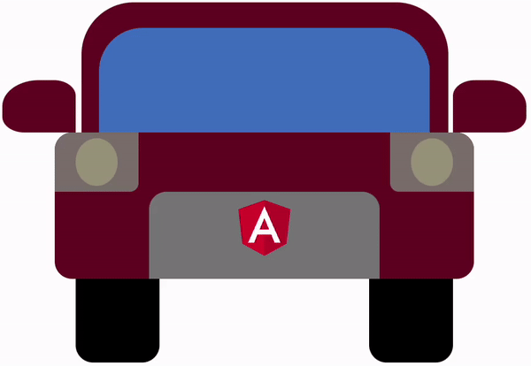

I recently had a longer car ride. And since car rides can be relatively boring if you don't steer the car by yourself, I started to develop a certain interest for the turn indicator.
As a big fan of Reactive Programming with RxJS I couldn't help but thinking about how we could implement this with RxJS!



## How the car works

First things first, let's take a look at the original behaviour of the circuit in the car.
Modern cars have an incredible amount of buttons, but setting a turn signal is still basically the same. The handle next to the steering wheel is nothing more than an on/off switch which can be locked in the end position.
This trigger behaves as follows:

- If you lightly touch the handle it instantly flips back to the resting position. The switch output is *ON* directly followed by *OFF*.
- If you push the handle to the end it will be locked in this position (*ON*). It only comes back to the resting position (*OFF*) if you pull the handle back again. (It also flips back when we turn the steering wheel in the opposite direction, but this out of scope here.)

The electronic part of the car does the following now:

- Whenever the trigger is *ON*, the turn signal starts to alternate between on and off.
- The signal ends ...
  - when the trigger is turned back to *OFF*
  - but not before at least 3 on/off cycles have been finished.

That means, if you just softly push the trigger, the turn signal outputs 3 on/off cycles.
If you lock the trigger, the signal is repeated until you pull the trigger back.
When you lock the trigger and pull it back immediately, the signal performs 3 cycles as well.

## Implementation with RxJS

With this overview in mind we can now start to implement things with RxJS step by step.

## The raw signal

At first, we need to construct the raw turn signal as an alternating sequence of `true` and `false`.
To create such a periodically emitting Observable, we can use the `timer()` and `interval()` creation functions from RxJS.

Calling `interval(500)` will create an endless stream of emissions. However, the first element will be emitted after 500 ms.
However, we want the signal to start immediately upon subscription.
This is why we choose `timer(0, 500)` here: It creates an interval as well, but the first emission will come up 0 ms after subscription.

Both `timer()` and `interval()` emit a sequence of numbers starting at `0`. You can interpret those as the index of the emitted element.
What we actually want, though, is a sequence of `true` and `false`.
So how do we convert increasing numbers to alternating booleans? Using the modulo operator and `map()`!

```ts
const stepTimeMs = 500;
const rawSignal$ = timer(0, stepTimeMs).pipe(map(e => e % 2 === 0));
```

## The trigger

Next up, we need to build the trigger handle to control the turn signal.
The switch behavior described above can be adapted with mouse clicks – except for the locking position which we ignore in this example.
If you simply press down the mouse button, it instantly goes back up. If you keep it pressed it will flip back up when you release it.

In order to keep this simple and framework-agnostic we use an HTML button here and access it through `querySelector()`. Of course, those events can also be captured in other ways, e.g. with an Event Binding in Angular.

With pure JavaScript and RxJS, events can be captured with the `fromEvent()` creation function from RxJS.
We create two streams here: one for the button press (pushing the trigger) and another one when the button is released (pulling the trigger back).

```html
<button id="trigger">Trigger</button>
```

```ts
const triggerBtn = document.querySelector('#trigger');

const press$ = fromEvent(triggerBtn, 'mousedown');
const release$ = fromEvent(document, 'mouseup');
```

As you can see, the release is not captured on the button but on `document` instead.
This is an important detail: You can move the mouse away while the button is still pressed. We still don't want to miss the release event which might be fired somewhere else.

## First wiring

We can now already start to wire things together.
Whenever the button is pressed we want to start the signal.
In other words, we want to convert each emission from `press$` into what is emitted by `rawSignal$`.
This way, whenever we press the button, `rawSignal$` should be subscribed and the emissions from the signal should be the result of our operation.

That is an excellent use-case for one of the four flattening operators: `concatMap`, `mergeMap`, `switchMap`, `exhaustMap`.
We want to map each emission of `press$` to the emissions from `rawSignal$`.

```ts
press$.pipe(
  concatMap(() => rawSignal$)
)
```

We should now talk about which operator is the right one for this case.
In terms of mapping to another Observable and merging its submissions into the output stream, they all do the same thing.
Their difference, however, lies in how they handle concurrent subscriptions.
So what happens if the signal is already running and we press the button again?

- **`concatMap`** builds a queue. When the first signal is finished, it will proceed with the next one. So if we click the button multiple times in a row, each of those signal "requests" will become a signal, finally. Honestly, this is not what we want!
- **`mergeMap`** concurrently subscribes to all of the inner Observables. When we press the button multiple times, multiple signals will be running simultaneously and act against each other. Not good!
- **`switchMap`** will cancel the running subscription when another one appears. So when we press the button while a signal is running, it will be cancelled and the new one will be started. Sounds much better!
- **`exhaustMap`** is one of the less commonly used operators: As long as an inner subscription is running, all other incoming requests will be ignored. That means, if we press the button while a signal is running, nothing will happen. There is no queue like with `concatMap` but all incoming things will be ignored.

From this evaluation, we can see that either `exhaustMap` or `switchMap` would be a good fit for our use-case.
`exhaustMap`, however, is a bit more resilient: When the signal is active, is has the highest priority and will be finished before another signal can be started at all.

```ts
press$.pipe(
  exhaustMap(() => rawSignal$)
)
```

## Displaying the signal

Before we continue with our RxJS implementation, let's first display what we've achieved until here.
To visualize the turn signal we want to highlight an element in orange when active.
We subscribe to our Observable to process the signal state and add/remove a CSS class accordingly.
In the full example below we created a car with CSS. However, you can also use a simple div element:

```html
<div id="signal"></div>
```

```css
.on {
  background: orange;
}
```

```ts
const signalEl = document.querySelector('#signal');

press$.pipe(
  exhaustMap(() => rawSignal$)
).subscribe(lightOn => {
  if (lightOn) {
    signalEl.classList.add('on');
  } else {
    signalEl.classList.remove('on');
  }
});
```

We can now see that – once we press the button – the signal starts to flash.
But it never stops! Our `rawSignal$` is an endless stream so we need to think about how we can terminate it.


## Terminating the signal

We have mapped each button press to our alternating signal, but this signal never ended.
Let's change this! To terminate a stream we can use the `takeUntil()` operator.
It takes a *notifier* Observable as an argument. When this notifier emits once, the result stream will be completed.

Let's explain this with a simpler example: We have a long-running interval which we combine with `takeUntil()`.
As the notifier we use an Observable that emits after 5100 ms (using `timer()` with just one argument creates an Observable that fires once and then completes).
The resulting Observable will emit the interval events, and will then complete after 5100 ms when the notifier fires.

```ts
const notifier$ = timer(5100);

timer(0, 1000).pipe(
  takeUntil(notifier$)
).subscribe(e => console.log(e))
```

```
// Result:
0
1
2
3
4
COMPLETE
```

Back to our turn signal, things become a bit more sophisticated.
The signalling period must be terminated when at least 3 cycles have passed *and* the trigger has been released.
The order of these events can be different, though:

- **Case 1:** We release the trigger *before* 3 cycles have finished: wait for 3 cycles to finish.
- **Case 2:** The trigger is still pressed after 3 cycles are finished: wait for the trigger to be released.

### Counting cycles

The first part of our closing notifier is the cycle count. We want the notifier to emit once after 3 cycles have passed.
Since we know the step interval time (we've used this before to create the interval) and the number of cycles, we can construct this using a `timer()`.

```ts
const cycles = 3;
const cyclesFinished$ = timer(stepTimeMs * cycles * 2);
```

The step time has to be multiplied by 2 because a full cycle consists of two steps (on and off).
For the trigger release, we have already created the necessary event stream `release$`, so we have the two parts ready to be combined.

### Creating the notifier

As described before, to create our closing notifier we have to wait for

- a trigger release *and*
- 3 cycles finished

The `forkJoin()` creation functions comes to rescue:
This function combines Observables. It subscribes to all of the sources at once. Then, after all the sources have completed, it emits one single event with the final results of all sources.

To make this possible, it is necessary that all sources eventually complete.
Our cycle counter is a deterministic timer which will emit once and then complete, so everything's fine here.
However, the `release$` stream captures all `mouseup` events from everywhere and will never complete.
What we are actually interested in is the *next* emission only, so we combine it with `take(1)`.
That way, we wait for the first emission only and then complete immediately.

Our notifier can be defined as follows:

```ts
const closingNotifier$ = forkJoin([
  release$.pipe(take(1)),
  timer(stepTimeMs * cycles * 2),
]);
```

### Putting things together

Now that we have created the notifier that tells us when the signalling period has to be over, we can put things together.
What we want to terminate is the individual signal stream that the press event is mapped to.
Right now, we convert each trigger press event to to an endlessly emitting signal event stream.
This is the part we have to change: We want the signalling to eventually come to an end.
It is therefore important to apply the `takeUntil()` operator to the inner mapped Observable, not to the outer stream that is derived from `press$`.

```ts
press$.pipe(
  exhaustMap(() => rawSignal$.pipe(
      takeUntil(closingNotifier$)
    )
  )
)
```

## Switching off the light

We can now see that the signal comes to an end after at least 3 cycles and when we release the button.
However, there's an tiny edge case:
When we press the button for longer than 3 cycles and then release it while the signal is active, the light stays on!
We have interrupted the signal stream somewhere in the middle and no subsequent emission made the light go off.

To change this, we have to tell our signal stream to always end with going off.
So whenever the inner mapped Observable completes, it should emit `false`.
Say hello to the `endWith()` operator!

```ts
press$.pipe(
  exhaustMap(() => rawSignal$.pipe(
      takeUntil(closingNotifier$),
      endWith(false)
    )
  )
)
```

Try it out: Press the trigger button for a longer time. Then release it while the light is on. It will immediately be switched off.

## Bonus: Making it mobile-friendly

In the beginning, we used `mousedown` and `mouseup` events to capture trigger press and release.
This works fine in a desktop browser. However, on mobile touch devices we rather have to use `touchstart` and `touchend` events instead.

Since the browser only emits one or the other event, we can combine them and use the first one that is available.
This can be achieved with the `race()` creation function: It listens to multiple Observables at once. When one of them emits, it wins the race and all of the others are unsubscribed.
In our case, whoever comes first – `mousedown` oder `touchstart` – will be used.

```ts
const press$ = race(
  fromEvent(signalEl, 'mousedown'),
  fromEvent(signalEl, 'touchstart')
);
const release$ = race(
  fromEvent(document, 'mouseup'),
  fromEvent(document, 'touchend')
);
```


## Wrap up

With relatively few lines of code we have created a car turn indicator with RxJS!
Each trigger press is converted to an alternating signal.
While a signal cycle is running, all other presses will be ignored.
The signal ends after the trigger is released and at least 3 cycles have been finished.
Regardless of how the interrupted signal ends, it will always switch off the light when it leaves the room.


**You can find a full working demo on Stackblitz:**

<iframe style="width:100%; height: 25em" src="https://stackblitz.com/edit/rxjs-turn-signal?embed=1&file=index.ts"></iframe>


-------

Special thanks to [Lisa Möller](https://moeller.media) who created the CSS car in the demo and took the header photo.

<small>**Header image:** Traffic in Moscow, 2018, by Lisa Möller</small>