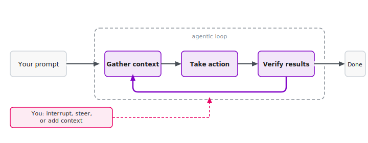
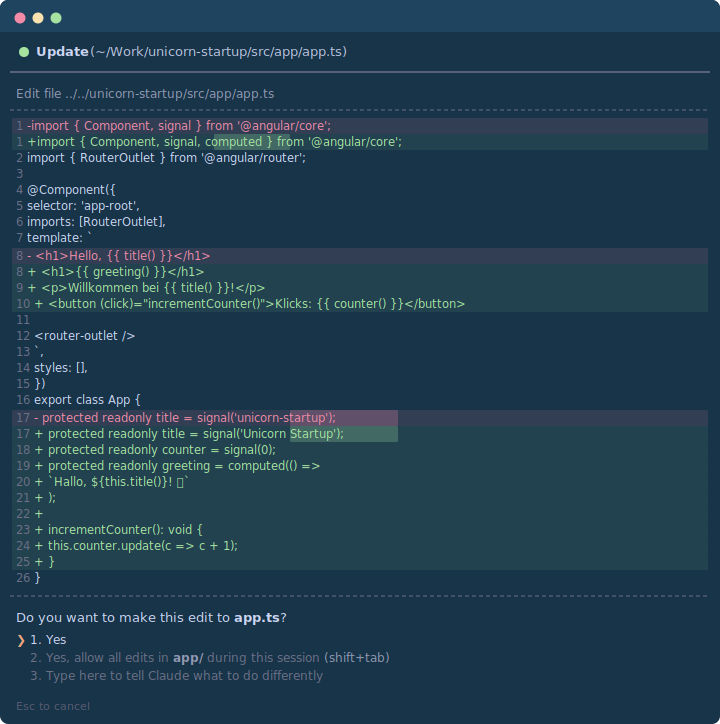
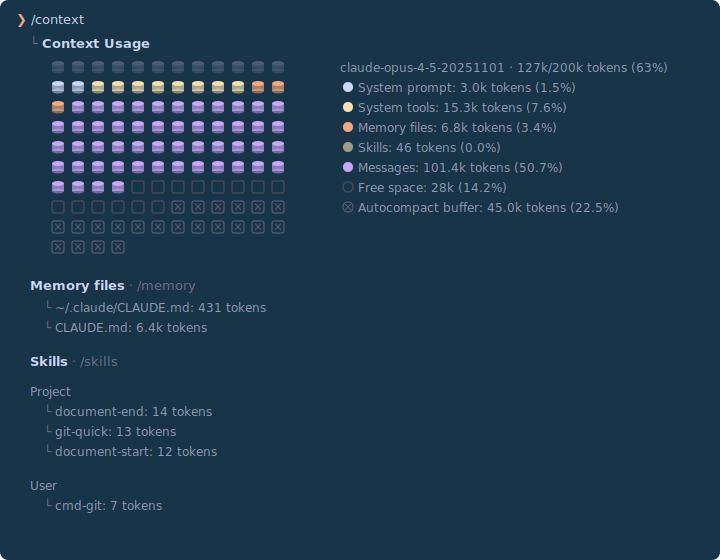
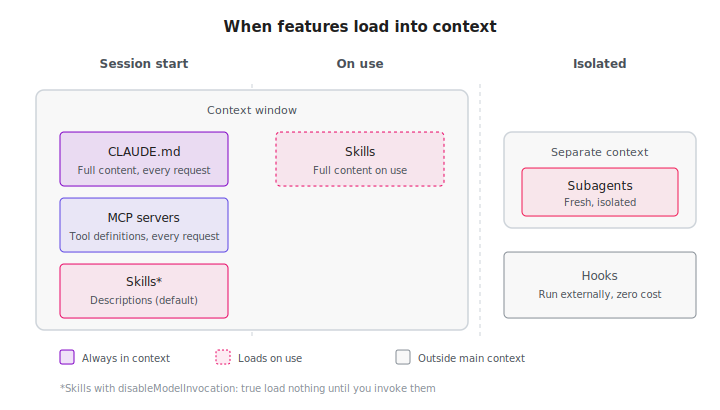
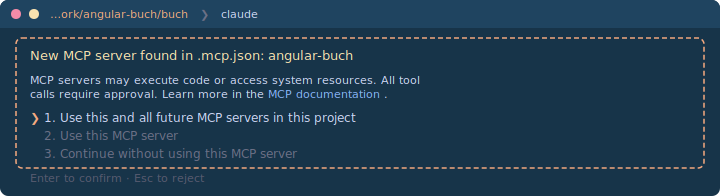
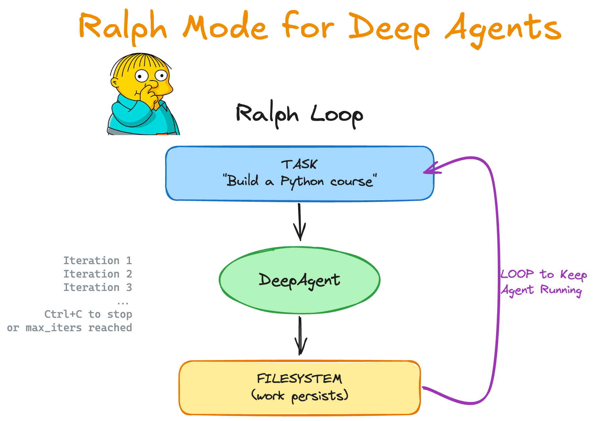

There has never been a better time to build software.
AI agents like Claude Code have fundamentally changed my workflow – I write better code in less time.
**In this article, I will show you how it works.
Whether you have been developing with Angular for years or are just getting started: the barrier to entry has never been lower.**

After reading this article, you will know how to install, configure, and use Claude Code for Angular projects – from the first component to the CI pipeline.

> 🇩🇪 Dieser Artikel ist auch auf Deutsch verfügbar: [Claude Code: Der AI-Agent für Angular-Entwickler](https://angular-buch.com/blog/2026-02-claude-code)

## Contents

[[toc]]

## What Is Claude Code?

Claude Code is the CLI version of Claude, the AI model by Anthropic.
The key difference from the browser chat: Claude Code works directly inside your project.
It reads your code, understands the context, and can make changes on its own.

Think of it this way: the browser chat only gives you advice.
Claude Code actually sits down at your desk and does the work. **Much better! 😎**

In concrete terms, Claude Code can read and edit your files, run shell commands, search the web for information, and even analyze images.
The agent decides on its own which steps are necessary and executes them one by one – you always see what is happening.
That sounds like a lot of power – but don't worry: you remain in control at all times and can confirm every step.



## Why a Terminal?

At first glance, the decision to use a terminal interface seems anachronistic.
Why not a sleek GUI with buttons and menus?
Why not a VS Code plugin with an integrated panel?

The answer lies in an interesting design decision: the terminal forces radical simplicity.
When your interface consists only of text, every piece of functionality must either be automated or made accessible through slash commands and keyboard shortcuts.
There is no fallback option like "add another button here, another dropdown there."

This constraint is also a strength.
For every feature, Anthropic has to ask: Can the agent detect this and handle it on its own?
Or is it used so frequently that it deserves a short command?
The result is an interface that works surprisingly well – precisely because it is so minimal.

Sounds promising? Let's get started.

## Getting Started

### Installation

The good news: installation takes about a minute.
Claude Code itself only requires a supported operating system (macOS 10.15+, Windows 10+, or Ubuntu 20.04+).
For Angular development, [Node.js](https://nodejs.org/) should also be installed.
Good to know: Claude Code likes to write shell scripts and also uses Python for more complex tasks – make sure [Python](https://www.python.org/) is installed if you want to take advantage of that.

**macOS / Linux:**

```bash
curl -fsSL https://claude.ai/install.sh | bash
```

**Windows (PowerShell):**

```powershell
irm https://claude.ai/install.ps1 | iex
```

After installation, simply start Claude Code with:

```bash
claude
```

On the first launch, you will be prompted to log in with your Anthropic account.
You need a Claude Pro subscription (approx. $20/month) or a Max subscription (starting at $100/month for heavier usage).
Tip: If you know someone with a Max subscription, they can generate an invitation code for you with `/passes` – this lets you try Claude Code for free for one week.
Don't know anyone? Write to us at team@angular.schule – we're happy to help!

#### First Launch

When you run `claude` for the first time, here is what happens:

1. **Theme selection:** Dark mode or light mode?
2. **Login:** A browser window opens for authentication
3. **Done:** You see the Claude Code prompt and can get started

If something goes wrong during installation: don't worry!
You can literally ask Claude (in the browser at claude.ai) how to install Claude Code.
Take a screenshot of the error message and ask for a solution – it's a perfectly practical approach, not a joke.

#### First Steps

Before you dive into complex Angular tasks, I recommend starting with something simple.
This way you get a feel for the workflow:

```bash
cd ~/Documents
claude
```

Then in the Claude Code prompt:

> List all files in this directory and briefly explain what they are.

Claude Code will analyze the files and give you an overview.
Then try something more exciting:

> Create an HTML page that simulates a calculator.

> I have a TypeScript project here. Explain the architecture to me.

> Write a shell script that finds all node_modules folders on my machine and displays their total size.

You will notice: the result is surprisingly good – and you didn't write a single line of code yourself.
Once you are comfortable with the interaction, you are ready for the actual workflow.

### The Workflow – A Chat

Now let's get concrete: what does daily work with Claude Code look like?
This is best illustrated with an example:

")

As you can see, the dialog is iterative: you give a task, Claude Code works on it, and you guide the process.

#### Confirmations and Control

In the default mode, Claude Code asks for confirmation before every file change and every shell command.
You see a diff and choose with the arrow keys: allow once, allow for the entire session, or reject.
In practice, I usually just press Enter – that confirms the pre-selected option.



If you trust the result – or simply want to step away from the screen without controlling every step – use the arrow keys to select the second option: allow for the entire session.
And for the truly bold, there is the **YOLO mode** (`--dangerously-skip-permissions`): everything runs without any prompts.
This is useful in isolated environments (containers, VMs, CI) – personally, I have never used it. Too risky for my taste.

#### Essential Commands

To get started, you only need four slash commands:

- **`/help`** – when you're stuck
- **`/clear`** – start a fresh session
- **`/compact`** – compress context when the session gets long
- **`/cost`** – how much has this session cost so far?


If something isn't working, **`/doctor`** helps – this command checks whether everything is set up correctly.

You'll pick up the rest (there are many more) as you go – or just ask Claude Code about them.
Updates usually happen automatically. If not, `claude update` on the command line does the trick.

While working, you only need to know `Ctrl+C` to cancel and `Ctrl+D` to exit.
Undo is `Ctrl+_` (not `Ctrl+Z`!). If you press `Ctrl+Z` out of habit, you'll suspend Claude Code – then use `fg` in the shell to get back.

The controls are quickly internalized.
But the quality of results depends on one key factor: context.

### Context Is Everything

The more Claude Code knows about your project, the better the code it produces.
This sounds obvious, but it is the single most important factor for success when working with AI agents.

#### Referencing Files

The simplest way to provide context is by referencing files.
You can mention them directly in your prompt:

> Look at src/app/user/user.service.ts and add a method for deleting users. Follow the style of the existing methods.

Claude Code reads the file automatically and understands the existing code.
You can also reference multiple files to make comparisons or transfer patterns:

> Compare src/app/old/legacy.service.ts with src/app/new/modern.service.ts. What are the main differences? Migrate the legacy service to the modern pattern.

In most cases, Claude finds the relevant files on its own.
You can use `@` in the prompt for file path autocompletion, but this is rarely necessary.

#### Including Images

A particularly practical feature: Claude Code can also analyze images.
Simply drag and drop a screenshot or mockup into the terminal and write:

> Implement this design as an Angular component. Use Tailwind CSS for styling.

This is especially useful when you want to turn UI mockups into components, analyze error messages from the browser, or understand diagrams and architecture descriptions.

#### The Context Window

There is, however, a technical limitation: every AI model has a limited context window.
For Claude, this is currently about 200,000 tokens – a lot, but during long sessions, earlier information can get "forgotten."
The context window is essentially the AI model's working memory – it determines how much information the model can consider at once.
A context window of 1 million tokens is already in beta – this will make work significantly easier.

When space gets tight, Claude Code shows this in the status bar:


With `/context` you can see exactly how the available space is distributed:



When space runs low, Claude Code automatically compresses the conversation history through a summary (Auto-Compact) – this works quite reliably by now.
With `/compact` you can also trigger this manually and specify what should not be lost in the summary. With `/clear` you start a completely fresh conversation – useful when you are switching to a new task anyway.

But context doesn't have to be provided spontaneously.
A much more elegant approach is to store project-specific rules permanently.

### Project Configuration

Claude Code can be configured on a per-project basis, so it knows from the start how your project is structured and which conventions to follow.

#### `CLAUDE.md` – Rules for Your Project

The simplest way: start Claude Code in your project and type `/init`.
Claude Code then analyzes the project structure, detects the framework in use, the test configuration, and the coding conventions – and generates an appropriate `.claude/CLAUDE.md` from that.

You can of course also create the file manually or customize the generated version.
A good starting point are the [Custom Prompts and System Instructions](https://angular.dev/ai/develop-with-ai) from Angular – a comprehensive ruleset covering best practices for TypeScript, Standalone Components, Signals, Accessibility, and more.

Here is a heavily shortened excerpt to illustrate the idea.
Tip: I recommend writing the `CLAUDE.md` in English, because Claude performs best with English-language instructions.
If you'd like to see which prompts and rules I use in my own projects, [feel free to reach out](mailto:johannes.hoppe@haushoppe-its.de) – this article is long enough as it is.

```markdown
# Angular Best Practices (from angular.dev/ai/develop-with-ai)
- Always use standalone components over NgModules
- Use signals for state management
- Use `input()` and `output()` functions instead of decorators
- Set `changeDetection: ChangeDetectionStrategy.OnPush`
- Use native control flow (`@if`, `@for`) instead of `*ngIf`, `*ngFor`

# Project-specific rules
- Unit tests with Vitest (not Karma/Jasmine)
- Data access via services using the Resource API
- Feature folders under src/app/, shared code under src/app/shared/
- API base URL: https://api.example.com/v1
- All user-facing text must be i18n-ready
```

In addition to the general Angular rules, the file should also contain project-specific information: test framework, API endpoints, folder structure, team conventions.
In practice, `CLAUDE.md` files are significantly more extensive than this example.
The file is loaded automatically at every start, and Claude Code follows these rules in all tasks.

There are several places where you can store such rules:

| Location | Scope |
|----------|-------|
| `~/.claude/CLAUDE.md` | Global for all projects |
| `CLAUDE.md` | For any directory (or `.claude/CLAUDE.md`) |
| `CLAUDE.local.md` | Personal, should be in `.gitignore` |

Claude Code traverses the entire directory hierarchy:
Files in parent directories are loaded at startup, files in subdirectories are loaded on demand.
This means you can also place a `CLAUDE.md` in a subdirectory like `src/` – it will be loaded as soon as Claude reads files there.
All discovered rules are combined, with more specific rules taking precedence.

You don't always have to edit the `CLAUDE.md` manually.
You can also ask Claude directly to remember something – in plain language:

> Remember: In this project we use Vitest instead of Karma.

With `/memory` you can view and edit all stored rules.



Rules are static – but Angular keeps evolving. For up-to-date knowledge, Claude Code needs more than custom prompts and training data.

### Angular MCP Server

One of the biggest problems with AI models is outdated training knowledge.
Angular evolves rapidly, and what was best practice a year ago may be obsolete today.
The MCP server (Model Context Protocol) of the Angular CLI solves this problem elegantly.

MCP allows Claude Code to access current Angular documentation and best practices – fresh and straight from the source.

#### Setup

The configuration is done in the `.mcp.json` file in the project root.
Here is what the file should look like – Claude can of course also create it for you directly:

```json
{
  "mcpServers": {
    "angular-cli": {
      "command": "npx",
      "args": ["-y", "@angular/cli", "mcp"]
    }
  }
}
```

#### Available Tools

With this configuration, Claude Code gains access to additional tools:

**Standard tools (always active, among others):**

| Tool | Description |
|------|-------------|
| `get_best_practices` | Current Angular coding guidelines |
| `search_documentation` | Searches the official Angular docs |
| `find_examples` | Code examples for modern features |
| `list_projects` | Identifies apps and libraries in the workspace |

**Experimental tools (must be enabled, among others):**

| Tool | Description |
|------|-------------|
| `modernize` | Migrates to modern patterns |
| `test` | Runs unit tests |
| `build` | Builds the project |

You enable the experimental tools with the `--experimental-tool` flag in the `.mcp.json`:

```json
{
  "mcpServers": {
    "angular-cli": {
      "command": "npx",
      "args": ["-y", "@angular/cli", "mcp", "--experimental-tool", "all"]
    }
  }
}
```

You can explicitly request these tools:

> Ask the Angular MCP server for best practices on Signal Forms.

Claude Code then retrieves current information that may be newer than its training knowledge.

> **Note:** MCP is crucial for AI-assisted Angular development. Frameworks evolve fast, and MCP bridges the gap between the model's training data and the latest best practices. By connecting your AI agent to up-to-date tooling, you ensure that generated code follows current conventions rather than outdated patterns.

### Your First Angular Project with Claude Code

Let's bring everything we've learned together in a concrete project.
Important: the Angular MCP server should be connected from the very beginning.
Only then does Claude Code have access to current best practices and avoids generating outdated code.

However, there is a chicken-and-egg problem: the MCP configuration needs a project directory – which doesn't exist yet.
The solution: let Claude Code create the project first, then restart, and from there on work with MCP connected.

```bash
mkdir book-app && cd book-app
claude
```

Instruct Claude Code to create the project and set up the MCP configuration:

> Run the following command: ng new book-app --ai-config=claude --directory .
>
> Then create an .mcp.json with the following content:
> {
>     "mcpServers": {
>         "angular-cli": {
>             "command": "npx",
>             "args": ["-y", "@angular/cli", "mcp"]
>         }
>     }
> }

The `--ai-config=claude` flag generates an appropriate `CLAUDE.md` for the project.
The `.mcp.json` connects Claude Code to the Angular MCP server – but only on the next start.
Press `Ctrl+D` and restart with `claude --resume`:



Now you're ready to go – with MCP connected from the start:

> Create the following features for the app:
> - BookListComponent displays a list of books
> - Data comes from a BookService using https://api.angular.schule/books
> - Use the Resource API and Signals
> - Routing: /books for the list, / for a home page
> - Unit tests for the service and the component
> - Start the dev server when everything is done

You confirm each step individually – or allow everything for the session and sit back.
At the end, you have a working Angular app with routing, service, component, tests, and a running dev server – built with current best practices, without having written a single line of code yourself.
That is exactly the point: what used to take half a day of setup, Claude Code handles in one session.

### Practical Examples

The app is up and running. In day-to-day work, however, it's often other tasks where Claude Code proves its value.

#### Fixing Build Errors

One of my most common use cases: passing the build error directly to Claude Code.
Ideally, Claude started the build itself – then it sees the problem and typically begins fixing it right away.
If not, a brief hint is enough:

> The build is failing:
>
> Error: src/app/user/user.component.ts:15:5
> Property 'users' does not exist on type 'UserComponent'.
>
> Analyze the problem and fix it.

Claude Code reads the affected file, understands the surrounding code, and suggests a fix.
Often the fix is done in seconds – including updating the tests.

#### Modernizing Legacy Code

Do you have a project with NgModules, the old `subscribe()` pattern, and `ngOnInit` everywhere?
Give Claude Code a clear assignment:

> Migrate src/app/legacy/ from NgModules to Standalone Components. Replace the HTTP calls with the Resource API. Preserve the existing functionality and update the tests.

#### Code Review + Fix in One Step

Instead of just listing problems: Claude Code can fix them directly.

> Review src/app/cart/ for performance issues, Angular best practices, and potential bugs. Then fix everything you find.

The pattern is always the same: describe what you want – Claude Code delivers.

## Going Deeper

That covers the setup. From here on, it's about getting the most out of Claude Code – and knowing its limits.

### Tips for Effective Work

After spending some time with Claude Code, you will recognize patterns that lead to better results.
Here are the most important insights from my own practice.

#### Be Specific

The golden rule: the more precise your prompt, the better the result.

```
❌ "Create a service"

✅ "Create a BookService with CRUD methods
   that uses the Resource API and loads books from
   /api/books. Follow the style of
   src/app/core/api.service.ts."
```

#### Iterate Instead of Perfecting

Don't expect the first result to be perfect.
The dialog is interactive – and that is a strength:

```
You: Create a login component.
Claude: [creates component]
You: Add validation.
Claude: [adds validation]
You: The error messages should be in German.
Claude: [adjusts texts]
```

An underrated trick: have Claude Code review its own work.
"Look at the code again – does it follow Angular best practices?" often yields surprisingly good improvements.

#### Plan First, Then Execute

My most important recommendation: don't let Claude Code start writing immediately.
Use the **Plan Mode** instead.

In Plan Mode, Claude Code works in read-only mode.
It reads your codebase, asks clarifying questions, analyzes the architecture – and then creates a structured implementation plan.
Only when you approve the plan does a single line of code get written.

You activate Plan Mode with `Shift+Tab` (press twice) or the `/plan` command.
Once the plan is ready, you can confirm it – only then does Claude Code begin the implementation.

Why is this so important?
As [described above](#the-context-window), the context window is limited – for larger tasks, the agent quickly loses the big picture without a plan.
In Plan Mode, Claude structures its "thoughts" in a Markdown file stored on disk.
Even if you run `/compact` or the context runs low – the file remains.
If Claude loses the thread after a compact, a quick "Read the current plan again" gets it back on track.

My workflow therefore looks like this:
1. **Plan Mode on** (`Shift+Tab` 2x or `/plan`)
2. **Describe the task**
3. **Review the plan** and refine if needed
4. **Approve the plan** – Claude Code executes it

#### Using Thinking

Independent of Plan Mode, there is another lever for quality: Extended Thinking.
Before each response, Claude Code runs an internal reasoning loop in which it prompts itself and "thinks through" the problem.
It is enabled by default and can be turned off via `/config`. I always keep it on.
Warning: without a Max subscription, the budget is used up quickly.

Plan Mode and Thinking improve results. But Claude Code can also simplify the surrounding workflow – for example with Git.

#### Git Integration

You no longer need to craft commit messages or write PR descriptions – Claude Code handles that.

##### Creating Commits

Simply indicate that you want to create a commit:

> Create a commit for the current changes.

Claude Code then automatically runs `git status` and `git diff`, analyzes all changes, suggests an appropriate commit message, and executes the commit after your confirmation.

##### Pull Requests

Pull requests can be created the same way:

> Create a pull request for this branch.

Claude Code generates a PR with a meaningful title, a summary of changes, and a test plan.
The prerequisite is the GitHub CLI (`gh`), which must be installed and authenticated.

##### Code Reviews

And if you want to know whether your changes might cause problems:

> Analyze the changes in the current branch compared to main. Are there any potential issues?

##### Recommendation: Turn Off Attribution

By default, Claude Code adds a trailer to every commit: `Co-Authored-By: Claude ...` and `🤖 Generated with Claude Code`.
This immediately reveals that an AI agent was involved – and in my view, this is unnecessary.

In the file `~/.claude/settings.json` (global) or `.claude/settings.json` (per project) you can turn this off:

```json
{
  "attribution": {
    "commit": "",
    "pr": ""
  }
}
```

This makes your commits look just like any other commit.

#### Plugins

Beyond Git, Claude Code can be extended through a [plugin system](https://code.claude.com/docs/en/discover-plugins).
In the official Anthropic marketplace, you'll find ready-made plugins that you can install directly – without having to configure anything yourself.

Type `/plugin` and switch to the **Discover** tab to browse available plugins.
Installation is done directly from Claude Code:

```
/plugin install plugin-name@claude-plugins-official
```

Here is a selection of useful plugins from the [official marketplace](https://code.claude.com/docs/en/discover-plugins):

| Category | Plugin | Description |
|----------|--------|-------------|
| Git Workflows | `commit-commands` | Commit, push, and PR creation as slash commands |
| Git Workflows | `pr-review-toolkit` | Specialized agents for PR reviews |
| Integrations | `github` | Direct GitHub integration via MCP |
| Integrations | `linear`, `asana`, `notion` | Connect project management tools |
| Integrations | `figma` | Load designs directly into Claude Code |
| Integrations | `sentry` | Integrate error monitoring |
| Code Intelligence | `typescript-lsp` | Type checking and navigation for TypeScript |
| Autonomy | `ralph-loop` | Iterative loops – Claude works autonomously until the task is done |

After installation, the plugins are immediately available as slash commands, e.g. `/commit-commands:commit`.
Especially when starting out, this is more convenient than formulating every workflow in natural language.

##### Ralph Loop – Autonomous Iteration

Particularly noteworthy is the `ralph-loop` plugin, named after Ralph Wiggum from The Simpsons – the kid who just keeps going, no matter what.
That is exactly the principle: Claude Code works in a loop on a task and doesn't give up until it's done.
After each iteration, a hook checks whether a defined success criterion has been met.
If not, the original prompt is fed back in – and Claude sees the changes so far in the file system and Git history.


<small>Source: [langchain-ai/deepagents](https://github.com/langchain-ai/deepagents/blob/main/examples/ralph_mode/ralph_mode_diagram.png) (MIT License)</small>

This enables automation of TDD cycles, refactorings, or migrations, for example.
A `--max-iterations` limit protects against infinite loops and uncontrolled costs.

But for all the enthusiasm: Claude Code is not perfect.

### Where Claude Code Hits Its Limits

No tool is flawless, and transparency matters more to me than hype.
Here are the weaknesses you should know about:

- **Hallucinations:** Claude Code sometimes invents APIs or functions that don't exist. This happens especially with less common libraries. Verify all claims – and don't assume that something truly doesn't work or doesn't exist. When in doubt, request a web search.

- **Outdated knowledge:** Training knowledge has an expiration date. The [Angular MCP server](#angular-mcp-server) helps with this.

- **Large refactorings:** When changes span many files, Claude Code sometimes loses track. Break complex tasks into smaller steps.

- **Tests with little substance:** The generated tests look good at first glance but often have weak assertions. `expect(component).toBeTruthy()` tests exactly nothing.

- **Over-eagerness:** Sometimes Claude Code "improves" things you didn't want changed. Be specific in your prompts about what should change – and what should not.

But there are also more serious risks:

- **Prompt injections:** Claude Code reads files, web pages, and MCP responses – and can interpret hidden instructions within them as legitimate commands. An HTML comment in a README, a manipulated dependency, or a poisoned MCP server is all it takes for the agent to unknowingly execute code or exfiltrate data. This is not a theoretical risk: security researchers have [found eight different ways to execute commands in Claude Code without confirmation](https://flatt.tech/research/posts/pwning-claude-code-in-8-different-ways/) (since patched). [Homograph attacks](https://x.com/sheeki03/status/2018382483465867444) – where a Cyrillic character makes a command look visually identical but functionally different – also become more dangerous through "Vibe Coding," because commands are often accepted without review.

- **Data loss:** A misunderstood instruction can delete or overwrite files. In December 2025, Google's AI coding tool Antigravity (with Gemini 3 Pro) in autonomous mode [wiped a developer's entire D: drive](https://www.theregister.com/2025/12/01/google_antigravity_wipes_d_drive/). That was not Claude Code – but the risk is fundamentally present with any AI agent that executes shell commands.

None of these weaknesses is a reason not to use Claude Code – but each one is a reason to review the generated code.
Against the more serious risks, an isolated environment helps.

### Docker Sandbox

If you want to play it safe, run Claude Code in a [Docker Sandbox](https://docs.docker.com/ai/sandboxes/).
You need Docker Desktop version 4.58 or later, running on macOS 14 (Sonoma) or later, Windows 10/11, or Linux.
Instead of:

```bash
claude
```

simply enter:

```bash
docker sandbox run claude .
```

The [Docker Sandbox](https://docs.docker.com/ai/sandboxes/) isolates Claude Code in a microVM – a lightweight virtual machine that provides stronger isolation than a regular Docker container.
While containers share the kernel with the host (and [a breakout is therefore possible](https://northflank.com/blog/your-containers-arent-isolated-heres-why-thats-a-problem-micro-vms-vmms-and-container-isolation)), a microVM has its own kernel – so an AI agent cannot escape the sandbox even with root privileges.
You need to log in once inside the sandbox (or pass an API key as an environment variable), but after that the sandbox persists until you explicitly delete it.

The best part: you barely notice a difference from normal work.
Your project directory is bidirectionally synchronized at the same absolute path as on the host.

> "This is file synchronization, not volume mounting. Files are copied between host and VM." ([Source](https://docs.docker.com/ai/sandboxes/architecture/))

Everything else is completely isolated: its own file system, its own home directory (`/home/agent/`), and its own Docker environment – the agent can start containers inside without seeing your host containers.
How the architecture works in detail is described by Docker in the [Sandbox architecture documentation](https://docs.docker.com/ai/sandboxes/architecture/).
Important to know: Docker Desktop and therefore the AI Sandbox is [not open-source software](https://docs.docker.com/subscription/desktop-license/), but a mix of open-source components and proprietary code. Only the Docker Engine itself is fully open source. The exact implementation of the sandbox synchronization is therefore not publicly visible. You are trusting a black box here.

The sandbox secures interactive usage. But Claude Code also works entirely without a chat – fully automated.

### Headless Mode and CI

Claude Code can also be used non-interactively – without a chat, without confirmations.
With the `-p` flag (for "prompt") you pass a task directly on the command line:

```bash
claude -p "Analyze src/app and list all components without unit tests."
```

Claude Code executes the task and outputs the result to `stdout` – ideal for shell scripts, Git hooks, or CI/CD pipelines.
Combined with `--dangerously-skip-permissions` and the Docker Sandbox, you can run a fully autonomous agent in an isolated environment.

## Conclusion

Claude Code has changed my daily work.
Not because it is perfect – it is not.
But because it takes over the boring parts of development: boilerplate, tests, configuration, commit messages.
This gives me more time for the things that truly matter: architecture, user experience, and creative problem solving.

And Angular is just the beginning.
Claude Code can just as easily write READMEs, create shell scripts, analyze CSV files, or explain RxJS Observables to you.
It is a universal tool – you decide what to use it for.

Just get started. Install Claude Code, open a project, type `/init`, and give it a first task.
The rest will follow.

<hr>

<small>**Header image:** generated with Adobe Firefly 3</small>
