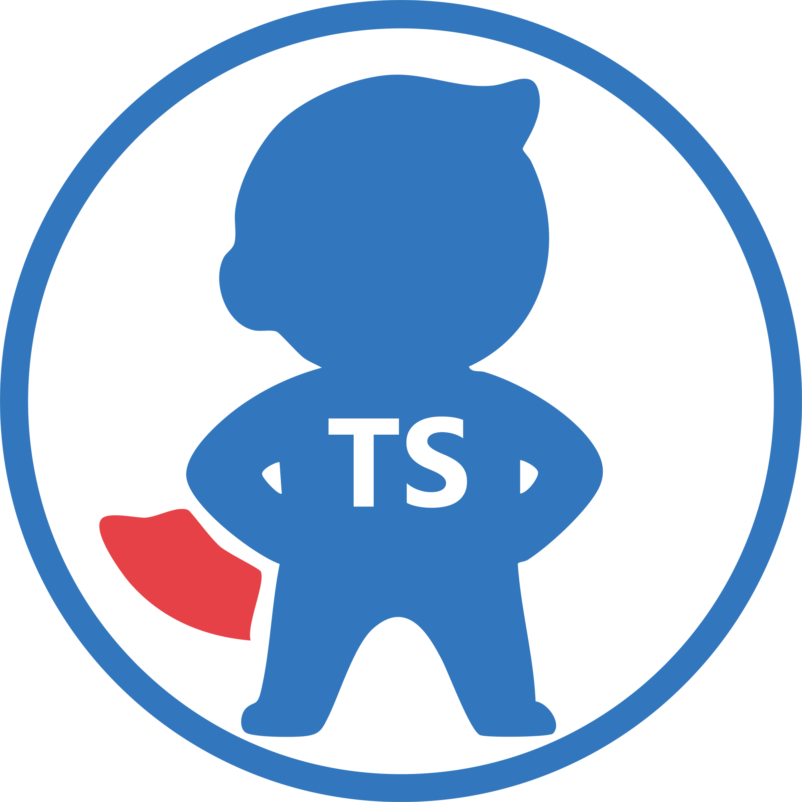
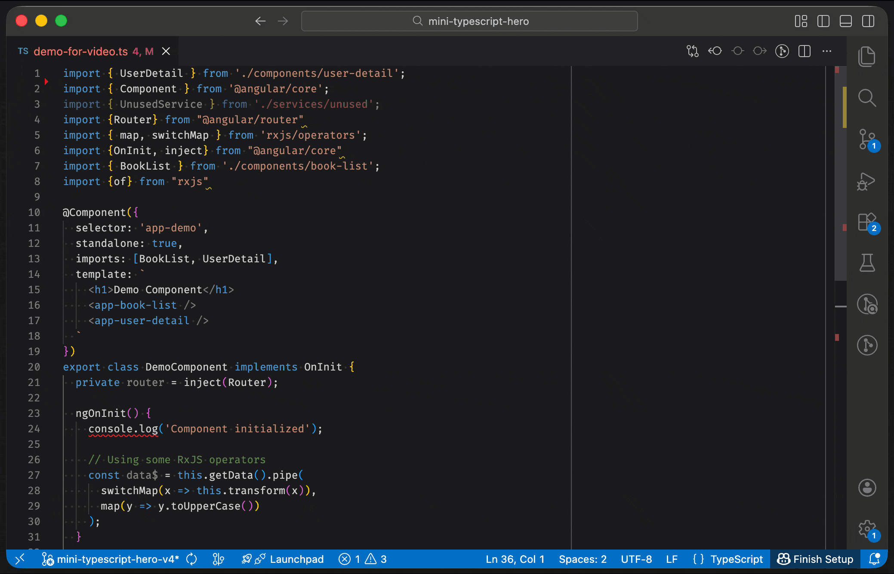
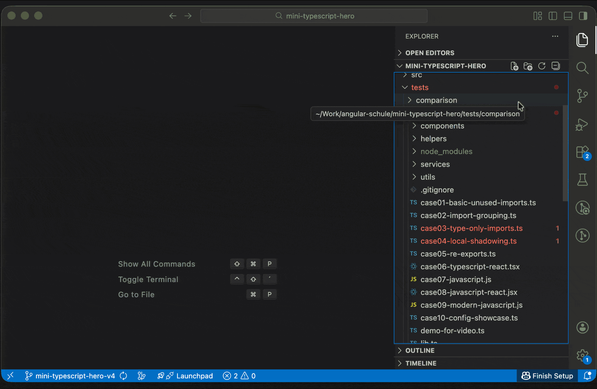

I use TypeScript Hero every single day. Multiple times per hour, actually. One keyboard shortcut (`Ctrl+Alt+O`) and my messy imports transform into a well organized, alphabetically sorted list. Unused imports? Gone. Proper grouping? Done. Consistent formatting? Check. Then one day, VSCode hit me with a warning I couldn't ignore: **"This extension is deprecated as it is no longer being maintained."** My heart sank. Not another one!

<p align="center" style="margin-top: 30px">
So, is TypeScript Hero dead? <b>Yes!</b><br>
But there's a new hero in town! 🦸‍♂️
</p>

<div align="center">
  
</div>

<h1 align="center">Mini TypeScript Hero – Small hero. Big cleanup!</h1>

## Contents

[[toc]]

## The Problem

Here's what TypeScript Hero does for me (and hopefully for you too):

**Before** (the chaos):

```typescript
import { UserDetail } from './components/user-detail';
import { Component } from '@angular/core';
import { UnusedService } from './services/unused';
import {Router} from "@angular/router"
import { map, switchMap } from 'rxjs/operators';
import {OnInit, inject} from "@angular/core"
import { BookList } from './components/book-list';
```

**After** pressing `Ctrl+Alt+O` (or `Cmd+Alt+O` on macOS):

```typescript
import { Component, inject, OnInit } from '@angular/core';
import { Router } from '@angular/router';
import { map, switchMap } from 'rxjs/operators';

import { BookList } from './components/book-list';
import { UserDetail } from './components/user-detail';
```

As you can see, the Angular libraries are grouped together and automatically merged into one import. Then the local imports follow, separated by a blank line. Unused imports are removed. Everything is sorted with consistent quotes and semicolons. And if you want, you could even go further and separate the RxJS operators into their own group. Beautiful.

**This really helps keep the code clean.**



## The Mission

[Christoph Bühler](https://me.cbue.ch/), the original author of TypeScript Hero, no longer had time to maintain the extension. He's moved on from TypeScript work, which is totally fair. We all have our seasons with different technologies.

But I needed this feature. Every. Single. Day.
So I reached out to Christoph with a simple question: Could I pick up TypeScript Hero and release it as a new extension?
His response was incredibly kind and supportive. He gave me his blessing, shared what code he still had, and even said he'd be excited to see the work continue.

**My mission was simple**: Preserve this feature for myself. And hopefully, other people will like it too.

## Cool New Features

While modernizing, I added some features that the original never had:

**🗂️ Organize entire folders or your whole workspace at once!**

Right-click any folder in the Explorer → "Organize imports in folder". Or run "Organize imports in workspace" from the Command Palette. Perfect for:
- Cleaning up after major refactorings
- Onboarding legacy projects to your team's import style
- Enforcing consistent imports across hundreds of files

The extension intelligently skips `node_modules`, `dist`, `build`, and other artifacts. You can also configure custom exclude patterns for auto-generated files your team shouldn't touch.



**⚠️ Conflict detection**

Using Prettier or ESLint plugins that also sort imports? Run "Check for configuration conflicts" to detect if multiple tools are fighting over your imports. This would have saved me a lot of fiddling in the past.

## Wait, Doesn't VS Code Already Have This?

**Yes, but no.** VS Code has a built-in "Organize Imports" feature that removes unused imports, sorts alphabetically, and merges duplicate imports. Since TypeScript 4.7+, it preserves blank lines you manually add between import groups. The fundamental difference is **how groups are created**: you manually type blank lines (VS Code preserves them), versus automatic grouping (Mini TypeScript Hero creates them).

**VS Code's approach:** You type blank lines between imports to create groups. VS Code sees these blank lines and treats them as group separators, sorting within each group while preserving the blank lines. If you want external (node_modules) imports separated from internal (local files) imports, you manually add a blank line between them and maintain it yourself every time you add new imports.

**Mini TypeScript Hero's approach:** The extension automatically separates external (node_modules) from internal (local files) imports with blank lines between them. This will cover most use cases without any configuration. Want more? Optionally add specific patterns like `["/^@angular/", "/rxjs/", "Workspace"]` to group framework or library imports separately. No manual maintenance required.

**What VS Code cannot do:**

❌ **Automatically create groups based on patterns** — Without manual blank lines, VS Code sorts everything alphabetically as one flat list  
❌ **Remove `/index` from paths** — Keeps `./lib/index` as-is instead of cleaning to `./lib`  
❌ **Sort by first specifier** — Only sorts by module path, not by the first imported name

**In practice:** When you add a new import, VS Code requires you to manually maintain blank line separators between import groups. With Mini TypeScript Hero, you press `Ctrl+Alt+O` and it automatically places imports in the correct groups with proper spacing. Configure once, organize forever.

## What Changed Under the Hood

The original TypeScript Hero used Christoph's own `typescript-parser` library ([node-typescript-parser](https://github.com/buehler/node-typescript-parser) on GitHub), a great piece of software that did its job well. But like the extension itself, it hasn't been maintained in years. Updating it to work with modern TypeScript versions would become increasingly challenging.

For a tool I rely on daily, that was a ticking time bomb.

**The old engine:**
- Custom-built `typescript-parser` (Christoph's library, great but unmaintained)
- InversifyJS for dependency injection
- A lot of hand-written infrastructure code from 2018

**The new engine:**
- [`ts-morph`](https://github.com/dsherret/ts-morph) for parsing (actively maintained, battle-tested)
- TypeScript with strict mode
- Leaner codebase — delegate the heavy lifting to a proven library instead of rolling our own parser
- No deprecated dependencies

**Other improvements:**
- **Smart blank line handling**: Choose how many blank lines you want after imports (1, 2, or preserve existing). The old behavior where blank lines would sometimes "move" unpredictably is now configurable.
- **Configurable import merging**: Combine multiple imports from the same module into one clean statement. Migrated users keep their original behavior; new users get modern best practices.
- **Modern TypeScript support**: Full support for `import type` syntax and import attributes<br>(`with { type: 'json' }`).

The goal was simple: **Future-proof**. Make sure this tool keeps working for years to come, without depending on abandoned libraries.

## Migration

If you're already using TypeScript Hero, switching is straightforward:

1. Install Mini TypeScript Hero from the marketplace
2. Open VSCode
3. Your settings automatically migrate (one-time, on first startup)
4. Done.

All your custom configurations transfer automatically — quote style, semicolons, import grouping rules, blank line handling, everything. The extension preserves your output format by automatically enabling `legacyMode: true` for migrated users, which matches the old TypeScript Hero behavior as closely as possible, including replicating certain quirks to ensure consistent output. You can switch to the new defaults anytime you want cleaner, more consistent behavior. You can even keep both extensions installed if you want, but I highly recommend deactivating the old hero because both will fight for the same shortcut. Speaking of which: the keyboard shortcut works exactly the same, `Ctrl+Alt+O` (or `Cmd+Alt+O` on macOS).

## A Quick Thank You

Thanks to Christoph Bühler for creating TypeScript Hero in the first place. The original code, the design decisions, the thoughtful features: all of that came from Christoph.

I'm committed to keeping this tool maintained and working for the community. This extension is **MIT licensed and free for everyone**.

## Install Mini TypeScript Hero Now

Ready to organize your imports with a single keystroke?

* **Install from VSCode Marketplace:**
    Search for "Mini TypeScript Hero" or visit:
    👉 [marketplace.visualstudio.com/items?itemName=angular-schule.mini-typescript-hero](https://marketplace.visualstudio.com/items?itemName=angular-schule.mini-typescript-hero)

* **Keyboard shortcut:**
    `Ctrl+Alt+O` (Windows/Linux) | `Cmd+Alt+O` (macOS)

* **Works with:**
    TypeScript, JavaScript, TSX, JSX

* **Found a bug or have a feature request?**
    👉 [github.com/angular-schule/mini-typescript-hero](https://github.com/angular-schule/mini-typescript-hero)

## What's Next? (Your call to action!)

Here's a genuine question: **Does nicely formatted code still matter in the age of AI?**

With AI generating more and more code, the temptation is to just let it write whatever and move on. But I still believe that clean, well-organized imports make a real difference. For readability, for code reviews, for the next person who opens your file.

So if you still care about this stuff, tell me. I'm considering a standalone CLI tool for CI pipelines, or an MCP server that formats all that AI-generated slop before it lands in your codebase. But only if someone actually wants it.

Please reach out! 🙏 [Give it a star on GitHub](https://github.com/angular-schule/mini-typescript-hero), [give me feedback via an issue](https://github.com/angular-schule/mini-typescript-hero/issues) or just drop me a nice message.

---

**TL;DR:** TypeScript Hero isn't really dead. I picked it up and modernized it as Mini TypeScript Hero. VS Code has basic organize imports, but Mini TypeScript Hero gives you custom grouping patterns, formatting control, and import organization that can match your team's style guide.

Happy coding! ✨
