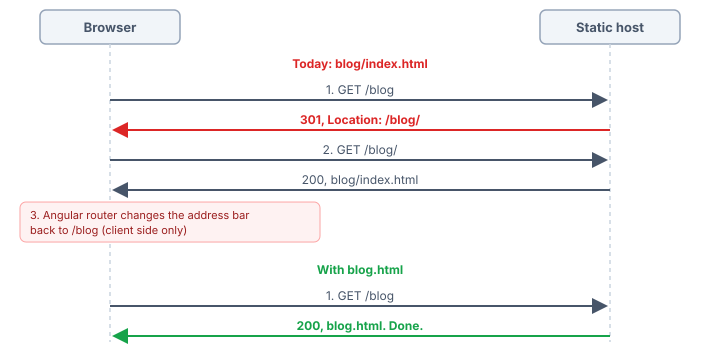

I love Angular.
But when it comes to prerendered static sites, the current situation is embarrassing compared to other major frameworks.
Astro, Next.js, SvelteKit: they all let you choose how your pages are written to disk.
Angular doesn't.

Prerender your app, deploy it to a static host (for example GitHub Pages, Cloudflare Pages or Firebase Hosting), and take a look at the network tab: every direct visit starts with a redirect to the same URL with a trailing slash, and a moment later the Angular router quietly removes the slash again.
You can get rid of the redirect, but only by putting a trailing slash on every URL of your site.
**Nice URLs or good SEO: with Angular's prerendering, you can't have both. In this article, I explain why, and how to get both today.**

## Contents

[[toc]]

## Today: nice URLs or good SEO, you can't have both

Angular's prerendering (SSG) writes every route into its own folder.
The route `blog/my-article` becomes `blog/my-article/index.html`.

A static host like GitHub Pages or Cloudflare Pages sees a request for `/blog/my-article`, finds a folder with that name, and does what web servers have always done with folders: it redirects to `/blog/my-article/`.

```bash
$ curl -I https://example.com/blog/my-article
HTTP/2 301
location: https://example.com/blog/my-article/
```

The browser follows the redirect, gets the `index.html`, Angular starts, and the router normalizes the URL back to `/blog/my-article`.
So you have to choose:

- **Nice URLs, but redirects:** Your links use `/blog/my-article`. Every direct visit (a search engine, a bookmark, a link shared on social media) starts with a redirect to `/blog/my-article/`, and the Angular router then removes the trailing slash again. The URL in your links is never the URL that actually answers.
- **No redirects, but trailing slashes everywhere:** Your links have to use `/blog/my-article/`. Pages answer directly, but every URL ends with a slash, and Angular needs an extra provider to keep it in the address bar: `{ provide: LocationStrategy, useClass: TrailingSlashPathLocationStrategy }` (see [`TrailingSlashPathLocationStrategy`](https://angular.dev/api/common/TrailingSlashPathLocationStrategy)).

Neither option feels right.
I tried both on our websites, and both made me unhappy.

## Why does Angular do this?

The file name is decided in exactly one place in the Angular CLI, the function `getRouteOutPath()` in `@angular/build`:

```typescript
function getRouteOutPath(route: string, baseHrefPathname: string): string {
  const routeWithoutBaseHref = getRouteWithoutBaseHref(route, baseHrefPathname);

  return stripLeadingSlash(posix.join(routeWithoutBaseHref, 'index.html'));
}
```

Every route ends up as `<route>/index.html`.
There is no option to change that.
This layout works on every web server in the world, which is a good default.
But many static hosts can do better: they serve `blog.html` under `/blog`, directly, without a redirect.
Angular just never writes `blog.html`.



## How do other frameworks handle this?

Static site generators have offered this choice for a long time.
Angular is the odd one out:

| Framework | Option | `about/index.html` | `about.html` |
|---|---|---|---|
| **Astro** | `build.format` | `'directory'` (default) | `'file'` |
| Next.js (static export) | `trailingSlash` | `true` | `false` (default) |
| SvelteKit | `trailingSlash` | `'always'` | `'never'` (default) |
| Nuxt 2 | `generate.subFolders` | `true` (default) | `false` |
| Hugo | `uglyURLs` | `false` (default) | `true` |
| **Angular** | – | always | – |

Next.js and SvelteKit even write `about.html` by default.
And the [Astro documentation](https://docs.astro.build/en/reference/configuration-reference/#buildformat) recommends `build.format: 'file'` together with `trailingSlash: 'never'`, which is exactly the combination Angular can't produce today.

## With `prerenderFormat: 'file'`: nice URLs and good SEO, we deserve both!

The fix is surprisingly small: write `blog/my-article.html` instead of `blog/my-article/index.html`.

- **Nice URLs:** `/blog/my-article`, without a trailing slash, in your links, in the address bar and in the server response alike.
- **Good SEO:** every page answers directly. Search engines see no redirect, and the URL they crawl is the same one your links point to.
- **Old links keep working:** on Cloudflare Pages, `/blog/my-article/` and `/blog/my-article.html` redirect to `/blog/my-article`.

Parent and child routes live side by side: `blog.html` next to the folder `blog/`, which contains `my-article.html`.
Both GitHub Pages and Cloudflare Pages serve `/blog` from `blog.html` in this situation, and `/blog/my-article` from the folder.
The start page stays `index.html`, and so does the start page of each locale (for example `en/index.html` with the base href `/en/`).

One difference between the two hosts is worth knowing: GitHub Pages answers an old address with a trailing slash like `/blog/my-article/` with its `404.html`.
For a prerendered Angular app, that's usually your app shell, so visitors still see the right page, but crawlers get a 404 status.
As long as you never linked your pages with a trailing slash, that's nothing to worry about.

We borrowed the terminology from Astro: `build.format` with `'directory'` and `'file'` became `prerenderFormat` with the same values.

## The real fix: an option in the Angular CLI

My colleague Ferdinand Malcher opened an issue for exactly this back in 2024: [angular/angular-cli#29173](https://github.com/angular/angular-cli/issues/29173), *"SSG/Prerendering: Allow generating foo.html instead of foo/index.html"*.
It didn't collect enough votes in the community voting process back then.

So we wrote the pull request ourselves: **[angular/angular-cli#34180](https://github.com/angular/angular-cli/pull/34180)** adds the option `prerenderFormat` to the application builder:

```json
"build": {
  "builder": "@angular/build:application",
  "options": {
    "outputMode": "static",
    "prerenderFormat": "file"
  }
}
```

- `"directory"` (default): `/foo/bar` is written to `foo/bar/index.html`, exactly as today.
- `"file"`: `/foo/bar` is written to `foo/bar.html`.

The option is meant for static builds only, by design.
With `outputMode: "server"`, there is nothing to fix: the Node.js server generated by Angular serves static files with `redirect: false`, so `/blog` is never redirected to `/blog/` in the first place.

**If you want this in Angular, please give the [issue](https://github.com/angular/angular-cli/issues/29173) and the [pull request](https://github.com/angular/angular-cli/pull/34180) a 👍.**
The Angular team decides based on community interest, so every vote counts.

## Can't wait? `@angular-schule/prerender-format`

Until the option lands in Angular, we built a drop-in builder that provides the same option for Angular 22: [`@angular-schule/prerender-format`](https://www.npmjs.com/package/@angular-schule/prerender-format).

```bash
ng add @angular-schule/prerender-format
ng build
```

`ng add` swaps the builder of your build target and sets the option:

```json
"build": {
  "builder": "@angular-schule/prerender-format:application",
  "options": {
    "outputMode": "static",
    "prerenderFormat": "file"
  }
}
```

All other options stay exactly as they are, the builder passes them on to `@angular/build:application`.
Once the option is part of Angular, you only switch the builder name back.

A static build is required.
An `ssr` entry is fine as long as `outputMode` is `"static"`: Angular then uses it only during `ng build` to prerender the pages, and no server is deployed.
If your build deploys a server (`"outputMode": "server"`, or `ssr` without `outputMode`), `ng add` and `ng build` stop with a clear error.

Let me be honest about how it works: the builder calls `buildApplication()` from `@angular/build` and replaces the internal function `prerenderPages()` at runtime, to rename the files before they are written.
That's a hack.
It relies on internal APIs, which is why it supports Angular 22 only, and why a built-in option is the real solution.
But it's a well-tested hack: it writes the same files as our Angular CLI patch, and it runs on the websites of [Angular.Schule](https://angular.schule) and the [Angular book](https://angular-buch.com).

## Things we learned along the way

Switching our sites to `.html` files revealed a few things that had been broken for a long time.
The redirect to the trailing slash had hidden them.

### Your `redirectTo` routes are probably 404s

On [angular-buch.com](https://angular-buch.com), we have short URLs that are printed in the book, like `/errata`:

```typescript
export const routes: Routes = [
  { path: 'errata', redirectTo: '/material/errata-4a' },
  // ...
];
```

These redirects only worked in the browser.
The server routes rendered everything that wasn't explicitly listed on the client (`{ path: '**', renderMode: RenderMode.Client }`), so there was no file for `/errata`.
The static host answered with its `404.html`, the app shell booted, and the Angular router redirected.
Visitors didn't notice, but search engines, link checkers and link previews saw a 404.

The fix: prerender every redirect route.
Angular then writes a small static page with a `<meta http-equiv="refresh">` for each of them, which works without JavaScript:

```typescript
// app.routes.server.ts
import { routes } from './app.routes';

export const serverRoutes: ServerRoute[] = [
  // ... your other server routes

  // Short URLs and old paths (redirectTo) as static redirect pages
  ...routes.flatMap((route): ServerRoute[] =>
    route.redirectTo && route.path && route.path !== '**'
      ? [{ path: route.path, renderMode: RenderMode.Prerender }]
      : []
  ),

  { path: '**', renderMode: RenderMode.Client }
];
```

### Pages missing from `getPrerenderParams()`

The same happened to our errata pages themselves.
They are marked as hidden in our content list, and `getPrerenderParams()` only returned the visible entries.
So the pages were never prerendered, and again the app shell rendered them from a 404.
If you hide content from a list, make sure it still ends up in `getPrerenderParams()`.

### A route called `index`

With `'file'`, a route `/index` would be written to `index.html` and overwrite your start page.
A route `/docs/index` would become `docs/index.html`, which web servers serve for `/docs/`, not for `/docs/index`.
Both builder and pull request stop with an error in this case.

### Your local preview server

If you preview the build locally with `express.static`, watch out: with `blog.html` next to the folder `blog/`, `express.static` finds the folder first and redirects `/blog` to `/blog/`.
Serve `<path>.html` before the static middleware:

```typescript
app.use((req, res, next) => {
  if (req.path.endsWith('/') || path.extname(req.path)) { return next(); }
  const file = path.join(distFolder, decodeURIComponent(req.path) + '.html');
  if (file.startsWith(distFolder) && fs.existsSync(file)) { return res.sendFile(file); }
  next();
});
app.use(express.static(distFolder));
```

## Conclusion

Angular's prerendering writes every route into a folder, and static hosts answer that with a redirect to a trailing slash.
Today, you have to choose between nice URLs and a site without redirects.

**We deserve both.**
Write `<route>.html` instead of `<route>/index.html`, and static hosts serve your pages directly under clean URLs.
Until Angular supports this natively, two commands do the trick:

```bash
ng add @angular-schule/prerender-format
ng build
```

And if you'd like to see this in Angular itself, please vote for the [issue](https://github.com/angular/angular-cli/issues/29173) and the [pull request](https://github.com/angular/angular-cli/pull/34180). 🚀

<hr>

**Further Reading:**

- [angular/angular-cli#29173: SSG/Prerendering: Allow generating foo.html instead of foo/index.html](https://github.com/angular/angular-cli/issues/29173)
- [angular/angular-cli#34180: feat(@angular/build): add `prerenderFormat` option](https://github.com/angular/angular-cli/pull/34180)
- [`@angular-schule/prerender-format` on npm](https://www.npmjs.com/package/@angular-schule/prerender-format) and [on GitHub](https://github.com/angular-schule/prerender-format)
- [Astro: `build.format`](https://docs.astro.build/en/reference/configuration-reference/#buildformat)
- [Angular: Server-side and hybrid rendering](https://angular.dev/guide/ssr)
- [Angular: `TrailingSlashPathLocationStrategy`](https://angular.dev/api/common/TrailingSlashPathLocationStrategy)
