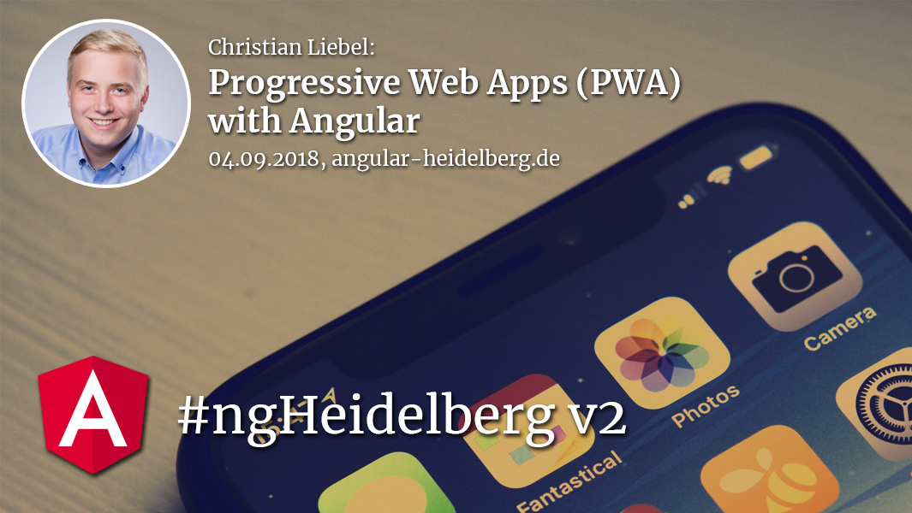

# Community updates, 2018-08-04

## Upcoming conferences:

1. Frontend Rhein-Neckar #3 26. September 2018 at UEBERBIT in Mannheim see http://meetu.ps/e/FKTYG/Fs9ND/f
1. Angular Days 2018, 09.-12. October in Berlin, by S&S Media see https://javascript-days.de/angular
1. Web Developer Conference (WDC), 16.-18. October 2018 in Munich, by Neue Mediengesellschaft Ulm mbH see https://www.web-developer-conference.de/
1. ⭐️ AngularConnect, 6. &. 7 November 2018 in London, see https://angularconnect.com/
1. NG-DE 2019, summer 2019 in Berlin, by Symetics GmbH, see https://ng-de.org 
1. Angular.Schule 4 days advanced workshop, 18.-21. September 2018 in Heidelberg, see https://angular.schule/schulungen/heidelberg 

## News:

1. Angular version 6.1 has been released.
   This is a minor release that is a drop-in replacement for 6.0 containing new features (TypeScript 2.9, Scroll Positioning, and more) and bugfixes.
1. Schematics for NativeScript announced `ng add @nativescript/schematics` ([source](https://blog.angular.io/apps-that-work-natively-on-the-web-and-mobile-9b26852495e7))
1. Schematics for Apollo Angular released `ng add apollo-angular` ([source](https://github.com/apollographql/apollo-angular/releases/tag/1.3.0))
1. ⭐️ Nrwl announced Angular Console — the UI for the Angular CLI (https://angularconsole.com/)
1. NgTalks Conference in Ukraine was a big success, continuous release of recorded videos on [Twitter](https://twitter.com/ngtalks_ua)
1. NgAtlanta Foundation announced their campaign called "the road of access" (https://donorbox.org/the-road-to-access), they are going to offer for conference scholarships, paid internships, ongoing mentors  etc. for underrepresented individuals to access our industry
1. Angular 7 is now in beta.4 ([source](https://github.com/angular/angular/blob/master/CHANGELOG.md#700-beta4-2018-08-29))
1. well informed core devs told us that Ivy won't come before NG8

