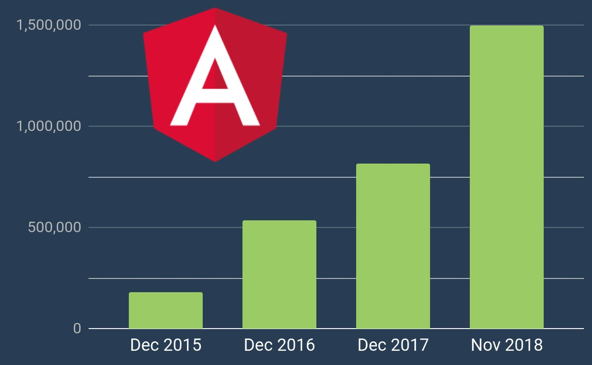

# Community updates, 2018-12-13

## Upcoming conferences:

1. :heart: ngGirls __Mannheim__, 19. January 2019, see http://ng-girls.org/mannheim-2019/
1. :de: NG-DE, 30. & 31. August 2019 in Berlin, see https://ng-de.org 
<!--1. Angular.Schule 4 days advanced workshop, 18.-21. September 2018 in Heidelberg, see https://angular.schule/schulungen/heidelberg -->
1. :star: ng-conf, 1. - 3. May 2019 in Salt Lake City, see https://www.ng-conf.org/

## News:

1. :rocket: Angular version 7 has been released. The 7.0.0 release of Angular is here! This is a major release spanning the entire platform, including the core framework, Angular Material, and the CLI with synchronized major versions.
   * CLI Prompts
   * Application Performance
   * Improved Angular Material & the CDK
   * Dependency Updates (TypeScript 3.1, RxJS 6.3, RxJS 6.3)
   * Ivy will be ready when it's ready
1. Angular docs traffic just crossed 1.5M monthly visitors. That's more than 50% yearly growth. 
1. StackBlitz 2.0 has been released (now includes the Angular Language Service)
1. Microsoft Edge is going to be Chromium-based ([source](https://blogs.windows.com/windowsexperience/2018/12/06/microsoft-edge-making-the-web-better-through-more-open-source-collaboration/))
1. https://ngrx.io has been launched
