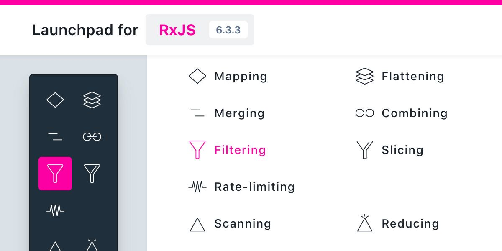

# Community updates, 2019-02-07

## Upcoming events:

1. 🇺🇸 ng-conf, 1.-3. May 2019 in Salt Lake City, see https://www.ng-conf.org/
1. 🇩🇰 ngVikings, 27.-28. May 2019 in Copenhagen, see https://ngvikings.org/
1. 🇩🇪 NG-DE, 30.-31. August 2019 in Berlin, see https://ng-de.org
1. _self-promotion:_ 🇩🇪 Angular.Schule, 26.-29. March 2019 in Heidelberg, see https://angular.schule/schulungen/heidelberg

## News:

1. :rocket: Angular version [8.0.0-beta.3](https://github.com/angular/angular/blob/master/CHANGELOG.md#800-beta3-2019-02-06)
    -  NG has a new (very) handy form feature `markAllAsTouched()` ! Everybody literally wrote this function in every project and now we don't have to do this anymore.
    - [Angular CLI 7.3.0-beta.0](https://github.com/angular/angular-cli/releases/tag/v7.3.0-beta.0) comes with conditional polyfills!
1. NgRx V7 has been released (and [nobody realised this](https://twitter.com/brandontroberts/status/1088081041535979520), because there are no breaking changes)
1. Introducing 🚀 Launchpad for RxJS - see https://reactive.how/rxjs/
   
1. Manfred Steyer (last time speaker) in now in the Angular Team (for tooling)
1. 2nd edition: Angular-Buch (Christoph Höller) was just published, see https://angular-buch.de/
1. 2nd edition: Angular-Buch (Malcher, Hoppe, Koppenhagen) is coming in March 2019, see https://angular-buch.com/
