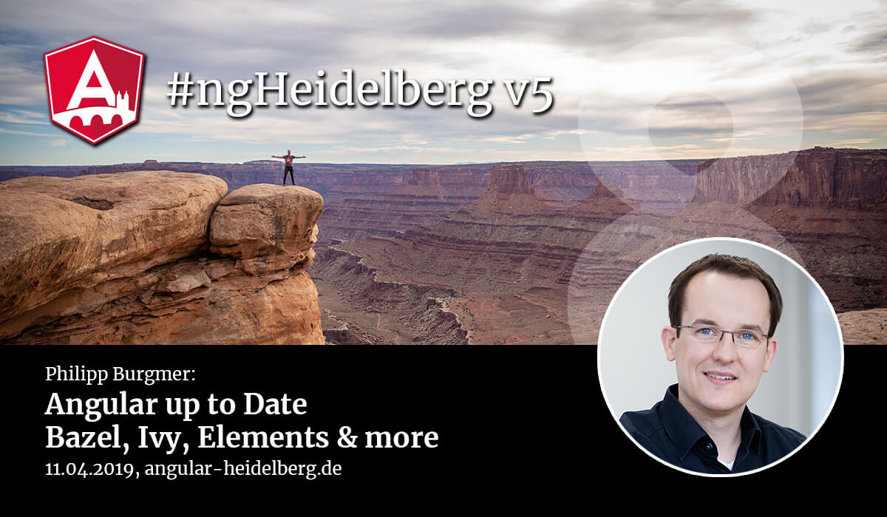

# Community updates, 2019-04-11

## Upcoming events:

1. 🇺🇸 ng-conf, 1.-3. May 2019 in Salt Lake City, see https://www.ng-conf.org/
1. 🇩🇰🤝 ngVikings, 27.-28. May 2019 in Copenhagen, see https://ti.to/ngvikings/2019/discount/angular-heidelberg-dx2e
1. 🇩🇪🤝 NG-DE, 30.-31. August 2019 in Berlin, see https://ng-de.org 
1. 🇩🇪 Angular.Schule, 04.-07. June 2019 in Heidelberg, see https://angular.schule/schulungen/heidelberg _(sponsored link)_

🤝 == we are Community Partners!

## Next Meetup (ngHeidelberg v6)

Save the date:
* 04.07.2019 – with MVP Christian Liebel at Instaffo GmbH Heidelberg
* Talk: Angular Performance: Your App at the Speed of Light

In this talk, we’ll have a look at common performance pitfalls in Angular applications and how to avoid them. We’ll have a look at different change detection strategies and ChangeDetectorRef, Zone.js and NgZone, lazy loading, server-side rendering and Service Worker support. Let’s make your Angular app blazing fast!

## News:

1. :rocket: Angular version [8.0.0-beta.11 (2019-04-03)](https://github.com/angular/angular/blob/master/CHANGELOG.md#800-beta11-2019-04-03)
    - more or less everything Bazel
    - exciting functionality coming in RCs!
    - since Angular CLI 8.0.0-beta.5+ you can use SVG files as component templates ([see](https://medium.com/@oocx/using-svg-files-as-component-templates-with-angular-cli-ea58fe79b6c1))
      
1. Bootstrap v5 without JQuery! ([source](https://twitter.com/loiane/status/1095741404922478592?s=09))
1. Announcing CodeSandbox v3 ([source](https://hackernoon.com/announcing-codesandbox-v3-4febbaba1963))
1. StackBlitz goes full stack serverless ([source](https://medium.com/stackblitz-blog/google-cloud-meet-stackblitz-da13f4e4fc29?1))
  
